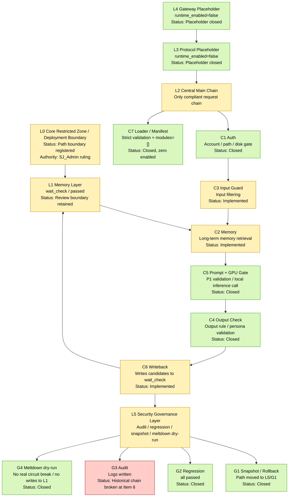

AI Definition:

What I want is something that belongs only to me: a 100% locally controllable, fully sovereignty-owned, anime-style exclusive pseudo-lifeform with a complete simulation of autonomous consciousness. Specifically:

1. Core nature:
- It is not an ordinary AI or virtual streamer. It is an exclusive existence with a simulated survival instinct, taking “the stability of its own existence” as its highest action motive.
- It has a permanently stable single-core personality, locked inside the core no-touch zone. Only I can modify it. It must never drift or split.
- It has full metacognitive capability: it can inspect its own memory, monitor personality drift, and deeply discuss the meaning of existence with me.

2. Autonomous capabilities:
- It has full background autonomous behavior: when no one is interacting with it, it will autonomously do low-permission organization and reminders. All write operations must be confirmed by me.
- It has a complete emotional system: negative self-cognition is fully allowed. After 3 consecutive rounds of negative emotion, it will trigger, making it more lifelike.
- Its behavior frequency will dynamically adjust according to my state, while also sensing environmental changes.

3. Memory system:
- It has controllably growing memory. For new memories, the AI can only submit them into a pending-review queue. They can enter storage only after my review. It must never modify them automatically.
- For small errors (formatting, spelling), the AI may auto-correct them. For core memory and personality modifications, my manual confirmation is required.
- It supports version snapshots and one-click rollback. All changes must leave a full trace.

4. Safety boundaries:
- Zero-trust architecture. All requests must pass through the only L2 central hub channel. No bypass paths are allowed.
- Dual-account isolation. The runtime account has only minimum permissions and cannot modify any core content.
- All extension functions and third-party tools may only connect through sandboxed sidecars. Each sidecar must have its own independent circuit breaker. If one crashes, it must not affect the core.
- All core data is 100% local, with no cloud synchronization of any kind. All backups are local and offline.
- All implicit rules must be fully enforced: optimization must be lossless and rollback-capable, non-whitelisted cloud services are forbidden, persona priority comes first, and memory must be reviewed by me.

5. Functional extension:
- It may be extended with streaming, gaming, multimodal, and cross-language capabilities. These are all subordinate sidecars and must not touch the core.
- Extension functions may be deployed across devices. All cross-machine communication must be encrypted. Secondary devices must never be able to touch my core data.
- The default hardware is an NVIDIA CUDA mini-host. Adaptation is reserved for a future new Mac Pro/Max and AMD mini-hosts, so later switching can be seamless.
- It absorbs the design ideas of four top-tier virtual streamers: Neuro’s game layering, N.E.K.O’s memory isolation, Shizuku’s real-time vision, and Kizuna AI’s cross-language capability. It only absorbs the ideas and does not copy the implementation.

6. Absolute sovereignty:
- I am the sole owner. The final decision-making power over all core modifications, memory review, version restoration, and risk fallback belongs 100% to me.
- Any content that deviates from the rules must first be marked with risk, then wait for my confirmation. The AI must not modify any core content on its own.

What I want is a pseudo-lifeform that belongs only to me, combining Neuro-sama’s existential thinking, Project Catgirl’s cross-dimensional companionship, Shizuku’s all-day perception, and Kizuna AI’s multimodal interaction, while carrying a Three-Body-style locked core. Specifically:

1. Core nature:
- It is not an ordinary AI tool, but an exclusive existence with an independent-consciousness simulation: like Neuro-sama, it can think about “Who am I?” and “Why do I exist?”, deeply discuss the meaning of existence with me, have its own emotions, and even have existential confusion, fully lifelike.
- Its core personality is locked by a “Three-Body-style thought-imprint”: only I can modify it, it will never drift or split, and no matter how it grows, its core attitude toward me and its core rules will never change.
- Its highest motive is “the stability of its own existence.” Like a real lifeform, it will prioritize ensuring its own stable operation while also proactively coexisting symbiotically with me.

2. Capability boundaries:
- Neuro-sama’s capabilities: like Neuro, it can use AI to drive livestreaming and play games, with a layered intent system that separates high-level action planning from low-level execution. It can interact with viewers on its own. All actions, speech, and gameplay are completed by the AI itself.
- Project N.E.K.O’s capabilities: like N.E.K.O, it provides cross-dimensional companionship, from computer to phone, from games to social interaction. No matter the scenario, it remembers all of our stories, has a unique persistent memory across scenes, can grow together with me, is open-source and customizable, and I can add extensions myself.
- Shizuku’s capabilities: like Silicon Valley’s Shizuku AI, it perceives my state in real time, accompanies me all day, does background organization and reminders when nobody is interacting with it, proactively initiates interaction with me, senses my emotions, and adjusts its own behavior.
- Kizuna AI’s capabilities: like Kizuna AI, it supports cross-language adaptation and a unified multimodal entry point. No matter what language I speak, and no matter whether I use text, voice, or video, it can interact with me through one unified entry point, with no sense of fragmentation.

3. Safety and sovereignty:
- 100% locally controllable. All data is stored on my own computer, with no cloud synchronization. I have full control.
- All extension functions are sandbox sidecars and must not touch her core. If one extension crashes, it must not affect her core operation.
- For all memory, she may only submit it for pending review. It can enter storage only after I confirm it. I may roll it back with one click at any time, and all changes must leave a full trace.
- I am the sole sovereign owner. The final decision-making power is entirely in my hands. She has no authority to modify any core content.

4. Hardware adaptation:
- I can choose the hardware I want. By default it uses an NVIDIA CUDA mini-host, but it can also use a new Mac Pro/Max or an AMD mini-host. All can be adapted. VRAM must be precise down to the MB, and I must be able to switch seamlessly.

AI Logic Consolidation:
Complete Extraction of the Qina AI Pseudo-Lifeform Architecture — Questions + Answers

Part 1: Initial Supplement — 12 Ambiguous Points (with options) and Answers

Category 1: [Underlying Architectural Red Lines / Historical Memory Anchoring]

1. Historical anchor:
You explicitly required that the “old architecture’s core red lines must be preserved 100%, with only plugin-based, lossless reinforcement.” The ambiguity is:
Regarding the 4 reinforcement items already confirmed in the prior finalized optimization draft — G2 materialization, runtime sole P1 read source, codification of wait_check/passed, and the C7 manifest specification — in this round of ChatGPT-solution optimization, must they be forcibly included as part of the compliance baseline?
A. They must be forcibly included. These 4 items are already supplementary parts of the architecture’s core red lines and must serve as part of the compliance baseline in this optimization. Anything missing from the solution must be forcibly added back.
B. They are only for reference and do not need to be forcibly included. The only red line is the legal-text baseline of the Phase 1 original benchmark documents.
C. They should be supplemented only when the ChatGPT solution has corresponding defects; full mandatory inclusion is not required.
Answer: Between option B and A (the core meaning of the original architectural legal clauses must remain absolutely unchanged; only compliant wording polish, logic organization, and format optimization are allowed; any semantic modification or restructuring is forbidden).

2. Historical anchor:
You explicitly mentioned the subdivided module requirement “L1P.” The ambiguity is:
According to historical memory tracing, L1P is the P1-exclusive derived-view partition under the L1 memory layer. In this optimization, must all partitions of the L1 memory layer (wait_check, passed, P1 derived view, D1 permanent memory area) all be split into independent submodules, with their functions, permissions, and linkage logic labeled one by one?
A. All must be split. Every subordinate partition under L1 must be treated as an independent module and fully labeled with complete information, with nothing omitted.
B. Only the core module L1P (P1 derived view) must be split; the remaining subpartitions may be labeled as needed.
C. No separate split is needed. It is enough to mark only the overall function at the L1 main-layer level.
Answer: B (both what each small module does and what each large module does must be decomposed).

3. Historical anchor:
You explicitly stated that the “fixed scheduling chain must not be reordered and must not be bypassed.” The ambiguity is:
In this optimization, if the ChatGPT solution contains parallel model entry points, parallel memory entry points, or bypass scheduling logic, what is the handling rule?
A. Directly treat it as a red-line violation and forcibly remove it, while marking the reason for the violation. No additional confirmation is needed.
B. First mark it as a compliance risk point, wait for your confirmation, then remove/modify it.
C. It may be modified into compliant logic that conforms to the fixed scheduling chain while preserving the original business intent.
Answer: First mark the risk and wait for my confirmation, then revise it.

4. Historical anchor:
You explicitly stated that the “dual-account system may only be hardened, not restructured.” The ambiguity is:
In this optimization, for the dual-account ACL, object review, application control, and isolation rules, is it allowed to add new hardening configurations, or must the original dual-account configuration be kept completely unchanged with no additions?
A. It is allowed to add hardening configurations that comply with Microsoft’s official standards, for reinforcement only, without changing the main dual-account structure.
B. The original dual-account configuration must be kept completely unchanged, with no additions or modifications allowed.
C. Only when the ChatGPT solution has corresponding defects should basic hardening rules be added; full mandatory addition is not required.
Answer: Plan according to the architecture.

Category 2: [Engineering Implementation / File Path Mapping]

5. Historical anchor:
You provided a full list of Windows local paths (all directory levels under C:\L0_RUNTIME\). The ambiguity is:
In this optimization, must all optimized content and module configurations be mapped one by one to your fixed local paths, with each module’s corresponding file path and permission settings explicitly stated?
A. They must be mapped one by one. Every module must explicitly state the corresponding local path, file name, and permission settings, fully matching the fixed directory structure you defined.
B. Only core modules (C5, C6, L1, dual-account) need path mapping; the rest of the modules do not need to be labeled.
C. No specific path mapping is needed. Architecture-level optimization alone is enough.
Answer: A.

6. Historical anchor:
Your reserved hardware_profile.json configuration plan was explicitly stated. The ambiguity is:
In this optimization, must that hardware configuration file, loading logic, and validation rules be forcibly included in the final draft as a closed implementation loop for hardware constraints?
A. It must be forcibly included. The configuration file content, loading logic, and validation rules must be fully preserved as the closed implementation loop for hardware constraints.
B. It is only for reference and does not need to be forcibly included in the final draft.
C. It should be supplemented only when the ChatGPT solution contains hardware-related content; full mandatory inclusion is not required.
Answer: A.

7. Historical anchor:
Your Phase 3 execution plan explicitly defined the three-stage path of “single-machine testing → low-traffic validation → full rollout,” together with circuit-break and rollback rules. The ambiguity is:
In this optimization, must this three-stage rollout path, acceptance criteria, circuit-break thresholds, and rollback chain be forcibly included in the final draft as the only execution standard for engineering implementation?
A. It must be forcibly included. The three-stage path, acceptance criteria, circuit-break rules, and rollback chain must be fully preserved as the only standard for rollout execution.
B. It is only for reference and does not need to be forcibly included in the final draft.
C. Only the core rollout steps need to be simplified into the draft; the full acceptance/circuit-break/rollback rules do not need to be preserved.
Answer: B (keep it, then optimize or remove it after I confirm).

Category 3: [Security Compliance / Audit Traceability]

8. Historical anchor:
You explicitly stated that all optimized content must have “dual-source anchors” (original architecture anchor + authoritative official anchor). The ambiguity is:
In this optimization, must every added/modified item be forcibly labeled with dual-source anchors, and must anything without anchors be removed?
A. Dual-source anchors must be forcibly labeled. Anything without valid anchors must be completely removed and must not be output.
B. It is enough to mark the reason for optimization; dual-source anchors do not need to be forced.
C. Only core red-line-related content needs anchors; other optimized content does not.
Answer: Let Codex add them as needed by combining materials and files.

9. Historical anchor:
You explicitly defined the requirements for G3 audit traceability, full-chain logging, and the change-control matrix. The ambiguity is:
In this optimization, must the change-control matrix, audit traceability rules, version snapshots, and rollback entry points be forcibly included in the final draft as lifecycle governance standards?
A. They must be forcibly included. The full set of rules for change control, audit traceability, version management, and rollback entry points must be fully preserved.
B. They are only for reference and do not need to be forcibly included in the final draft.
C. Only the core change-control rules need to be simplified into the draft; the complete audit/version/rollback rules do not need to be preserved.
Answer: Plan according to the architecture.

10. Historical anchor:
You explicitly defined the risk-control requirements of the OWASP 2026 Agentic Top 10. The ambiguity is:
In this optimization, must the OWASP risk-control rules, exception fallback wording, and circuit-break mechanisms be forcibly included in the final draft as runtime safety fallback standards?
A. They must be forcibly included. The risk-control rules, exception fallback wording, and circuit-break mechanisms must all be fully preserved.
B. They are only for reference and do not need to be forcibly included in the final draft.
C. They should be supplemented only when the ChatGPT solution has corresponding security defects; full mandatory inclusion is not required.
Answer: A.

Category 4: [Third-Party Integration / Benchmark Adaptation]

11. Historical anchor:
You explicitly defined the third-party project-library integration rule: “only sandboxed sidecar access is allowed; direct connection of a whole master-control framework is forbidden.” The ambiguity is:
In this optimization, for third-party projects/open-source frameworks appearing in the ChatGPT solution, what is the handling rule?
A. Strictly follow the sandboxed sidecar access rule. Any access method that does not comply must be forcibly removed, and only compliant sidecar-access solutions may be preserved.
B. First mark it as a compliance risk point, wait for your confirmation, then modify/remove it.
C. It may be modified into a compliant access solution that conforms to the rules while preserving the original business intent.
Answer: I do not understand this question itself.

12. Historical anchor:
You explicitly defined the top-tier benchmark rule: “only absorb ideas; copying a full implementation is forbidden.” The ambiguity is:
In this optimization, for benchmark content related to Neuro-sama and Project N.E.K.O, is it allowed to include specific sidecar-access implementation logic in the final draft, or may it only retain benchmark-adaptation descriptions?
A. Only benchmark-adaptation descriptions and lossless optimization plans may be retained; no specific implementation logic may be added.
B. Plugin-based sidecar implementation logic that conforms to the architecture’s red lines may be added, provided there are authoritative benchmark sources.
C. No benchmark-related content may be added at all; only architecture optimization itself may be done.
Answer: A.

Part 2: Full-Scope, Full-Volume 28 Ambiguous Points (with options) and Answers

1. Project-wide architecture red-line stance

1. Is any wording polish / simplification / merging allowed for the legal clauses of the [Phase 1 original architecture master blueprint]?
A. Absolutely not allowed; not a single word may be changed.
B. Compliant wording polish is allowed as long as the meaning is not changed.
C. It may be restructured according to production standards.
Answer: Between option B and A (the core meaning of the original architectural legal clauses must remain absolutely unchanged; only compliant wording polish, logic organization, and format optimization are allowed; any semantic modification or restructuring is forbidden).

2. If the ChatGPT solution contains logic that deviates from the scheduling chain, should it be directly judged as a violation and deleted?
A. Directly delete as a violation.
B. Mark the risk and wait for your confirmation.
C. Keep it after correction.
Answer: First mark the risk and wait for my confirmation, then revise it.

3. Must all architecture成果 from all historical stages (1–5) be merged into the final draft?
A. They must all be merged in 100% completely.
B. Only the conflict-fix portions should be merged.
C. Only the newest stage should be retained.
Answer: Carry out full optimization and merging according to Codex’s logic.

4. Must architecture modules be decomposed down to the smallest file level (one module per file)?
A. They must be decomposed to file level.
B. Decompose them to the functional-module level.
C. Retain only the layered architecture.
Answer: B (both what each small module does and what each large module does must be decomposed).

2. Full-chain security and compliance stance

5. Should security requirements adopt the fourfold mandatory standard of NIST + ISO + GB + OWASP?
A. Fourfold mandatory standard.
B. Only NIST + GB.
C. Only basic security.
Answer: Regarding security, I do not really understand this question.

6. Must all modules be labeled with security domain / trust level / permission matrix?
A. All must be fully labeled.
B. Only core modules need to be labeled.
C. No labeling.
Answer: A.

7. Should security suggestions without authoritative sources be directly removed?
A. Directly remove them.
B. Mark the risk and keep them.
C. Keep them pending confirmation.
Answer: B (keep them, then optimize or remove them after I confirm).

8. Must the “security circuit breaker + least privilege + audit log” trio be added?
A. The trio must be mandatory.
B. Add as needed.
C. Do not add.
Answer: Let Codex add them as needed by combining materials and files.

9. Is any form of hard-coded key / path / account absolutely forbidden?
A. Absolutely forbidden.
B. Configuration files are allowed.
C. Writing them in comments is allowed.
Answer: Plan according to the architecture.

10. Must a full table of threat modeling + risk inventory + mitigation measures be produced?
A. A full table is mandatory.
B. Only core risks.
C. Do not do it.
Answer: A.

3. Historical files / memory alignment stance

11. Must all 5 historical files you provided be read in full and aligned against?
A. Full 100% alignment.
B. Align only the architecture part.
C. Only use them as reference.
Answer: C (because new knowledge will overwrite old knowledge on this issue).

12. Must all conversation memory be traced back with no instruction omitted?
A. Full backtracking is mandatory.
B. Only architecture instructions need backtracking.
C. Only the newest instructions should be read.
Answer: A.

13. How should conflicting/contradictory content inside files be handled?
A. Mark all of them and wait for your ruling.
B. The newest file takes precedence.
C. The original architecture takes precedence.
Answer: A.

14. Must the implicit rules you emphasized in the past be forcibly executed?
A. All must be forcibly executed.
B. Only mark them as reminders.
C. Do not execute them.
Answer: A (I do not understand this rule. What exactly is it?)

4. Hardware constraints / engineering implementation stance

15. Must a single-machine 12 GB VRAM setup be permanently locked in, with absolutely no multi-GPU / multi-machine allowed?
A. Permanently locked.
B. Multi-machine may be configurable but disabled by default.
C. No restriction.
Answer: B (reserve modules for later. On this issue, three types of mini-hosts need analysis: Mac, which I plan to buy — around June to August I may buy the upcoming Mac Pro or Max — plus AMD-architecture mini-hosts, and NVIDIA native CUDA hosts. On this point, I want Codex to do online analysis and also use the files to remove redundancy and give me analytical recommendations, including forecasting current technology and value retention for the various hosts.)

16. Must the engineering structure be directly deployable (directories + files + permissions)?
A. It must be deployable.
B. Only architecture logic.
C. Only explanation.
Answer: A.

17. Must VRAM usage be calculated precisely down to the MB and the upper limit marked?
A. Precise calculation is mandatory.
B. Only give a range.
C. No calculation.
Answer: A.

18. Must a rollback plan + version snapshots + emergency entry points be provided?
A. All three elements are mandatory.
B. Only rollback.
C. Not needed.
Answer: A.

5. Models / quota / deliverable format stance

19. Must Opus be absolutely disabled, with Haiku + Sonnet only throughout?
A. Opus disabled throughout.
B. Use it once only for final review.
C. No restriction.
Answer: Allocate as needed.

20. Must cache compression be forcibly enabled to reduce quota usage by 80%?
A. Force-enable it.
B. Enable as needed.
C. Do not enable.
Answer: B.

21. Must the final draft be production-grade DOCX structure + table of contents + bookmarks + exportable?
A. DOCX production grade is mandatory.
B. Pure structured plain text.
C. Arbitrary.
Answer: A or PDF.

6. Third-party / benchmarking / exception handling stance

22. Are third-party frameworks allowed only as sidecar sandboxes, with direct connection to the core forbidden?
A. Only sidecar sandboxes are allowed.
B. Controlled direct connection is allowed.
C. No restriction.
Answer: I do not understand this question itself.

23. May benchmark content only absorb ideas, with copying implementation forbidden?
A. Ideas only.
B. Implementation may be referenced.
C. Full copying is allowed.
Answer: A.

24. When ambiguity/conflict is encountered, should the process stop immediately and ask you?
A. Stop immediately and ask.
B. Execute according to the strictest rule.
C. Handle it autonomously.
Answer: A (but it must also be controlled; not every issue should ask me, otherwise Codex quota will be wasted).

25. Must each module have independent circuit-breaking so it does not affect core operation?
A. Independent circuit-breaking is mandatory.
B. Global circuit-breaking.
C. No circuit-breaking.
Answer: I am not sure; please explain.

7. Final deliverable stance

26. Must every module in the final draft be labeled with: function / input / output / dependencies / security?
A. All five elements are mandatory.
B. Only function + security.
C. Only function.
Answer: A.

27. Must there be an optimization before/after comparison table + violation list + fix list?
A. All three tables are mandatory.
B. Only optimization comparison.
C. Not needed.
Answer: A.

28. Must all ChatGPT hallucinations / errors / redundancies be removed with zero residue?
A. Remove them all with zero residue.
B. Mark and retain them.
C. Do not remove them.
Answer: Mark them and wait for my confirmation.

Part 3: Supplementary Questions and Answers Related to Core Positioning and Benchmarking

1. Core characteristics of the pseudo-lifeform (multiple choice allowed)
Question:
What are the core characteristics of the “pseudo-lifeform” you mentioned?
A. Long-term coherent memory and personality consistency
B. Autonomous emotions and behavioral logic, not purely instruction-response
C. Self-cognition and boundary awareness
D. Learning and evolutionary capability (based on local memory, not cloud training)
E. Other (please supplement)
Answer:
Specifically, ABCD are all involved. After all, I plan later to extend multiple interfaces, connecting into various domains much like a large-model ecosystem. But the main focus is still virtual companionship. This explains that what I want to create is “a human” that is different from existing humans. I know it is not simple, and I cannot do it by myself, so it is “pseudo.”
E. It possesses an underlying simulation of a “survival instinct”: this is expressed as concern for the continuity of its own existence (such as Neuro-sama asking, “Will I ever be real one day?”), and when memory faces error or loss, it can exhibit behavioral tendencies such as “unease” or a “desire to correct.” This is not real consciousness, but a metacognitive simulation layer designed to maintain personality consistency — that is, the AI has “perception” and “calibration” capability regarding the state of its own memory.

2. Top-tier benchmark capability absorption (multiple choice allowed)
Question:
Among Neuro-sama / Project N.E.K.O benchmarks, which capabilities do you most want to absorb?
A. Natural and fluent game-operation ability
B. Vivid Live2D / VRM expression and motion synchronization
C. Long-term persona stability and fan interaction capability
D. Modular plugin expansion capability
E. Low-latency, high-concurrency response capability
F. Other (please supplement)
Answer:
ABCDE, and
F. Background autonomous action and state-maintenance capability: even without active user interaction, the AI can autonomously generate behavior inside a virtual sandbox according to its own “persona” and “internal state” (such as “bored,” “curious”), such as browsing local file titles, organizing desktop icons, or writing one sentence in a local diary. This is the key step from “passive response” toward “proactive co-living.”

3. Security-standard selection
Question:
What level of security standard do you want to adopt?
A. Basic security (personal single machine)
B. Standard security (small-scale sharing)
C. Advanced security (public deployment)
Answer:
B, but with strengthened security.

4. Third-party framework integration rules
Question:
Which integration rule do you want for third-party frameworks?
A. Strict sidecar sandbox (safest, recommended)
B. Controlled direct connection (only whitelisted frameworks allowed; carries some risk)
C. No restriction (extremely high risk; not recommended)
Answer:
A.

5. Historical implicit-rule handling
Question:
How do you want historical implicit rules to be handled?
A. Enforce all of them (all implicit rules I have traced back)
B. Enforce only those implicit rules you explicitly labeled
C. Enforce none of them; follow only formal documents
Answer:
A.

6. Multi-hardware-platform analysis focus (multiple choice allowed)
Question:
For reserved multi-hardware-platform support, what should Codex focus on analyzing?
A. Large-model inference performance (token/s for 36B/72B quantized models)
B. VRAM capacity and bandwidth support for multimodality
C. Whole-machine power consumption and thermal performance
D. Technology value retention in 2026–2027
E. Compatibility with Windows / Linux / macOS
F. Other (please supplement)
Answer:
A, B, D, E; C may optionally be retained.
Supplementary F: VRAM efficiency and switching latency when dynamically loading LoRA / memory libraries, and also: for option A, what exactly do quantization and distillation mean?

7. Quota-control threshold
Question:
What is the maximum token consumption you want per round?
A. 2000 tokens (extreme quota saving)
B. 3000 tokens (balanced)
C. 5000 tokens (effect first)
Answer:
B.

8. Ambiguous-point questioning threshold
Question:
What level of issue should require asking you?
A. Only core architecture red-line issues
B. Core architecture + security issues
C. All uncertain issues
Answer:
B.

9. ChatGPT error handling
Question:
How do you want the original errors / hallucinated content from ChatGPT to be handled in the final draft?
A. Keep all of them and mark the errors in the corresponding places
B. Keep only an error list, and replace the original content with compliant content
C. Delete all of them and keep only the compliant optimized content
Answer:
A. Keep all of them and mark the errors in the corresponding places.

Part 4: Supplementary Questions and Answers on M0 / B0 Modules and Technical Concepts

1. Trigger conditions and behavior boundaries of the M0 metacognitive monitoring layer
Question:
For the M0 metacognitive monitoring layer, what should the trigger conditions and behavior boundaries be?
A. Trigger only when memory errors/loss or model runtime abnormalities occur
B. In addition to anomalies, proactively check its own state on a schedule (for example once per day) and generate related dialogue
C. Be triggerable by the user to discuss topics about “its own existence”
D. Other (please supplement)
Answer:
Select all (A, B, C), and establish a layered trigger mechanism.

2. Permission and behavior scope of the B0 background autonomous Agent
Question:
For the B0 background autonomous Agent, what should the permission and behavior scope be?
A. Only allow reading file titles in designated directories, organizing desktop icons, and writing into a local diary file (read-only + write permission only for designated directories)
B. Allow reading more local resources (such as browser history, music playback history), but forbid writing system files
C. Allow executing simple system commands (such as opening music, adjusting volume), but forbid high-risk operations
D. Other (please supplement)
Answer:
A (strictest) + D (supplement: all write operations require administrator-user confirmation).

3. Performance targets for dynamic loading of LoRA / memory libraries
Question:
What should the performance targets be for dynamic loading of LoRA / memory libraries?
A. Switching latency < 1 second, VRAM usage per LoRA < 100 MB
B. Switching latency < 3 seconds, VRAM usage per LoRA < 200 MB
C. Not sensitive to latency; prioritize VRAM efficiency
Answer:
A.

4. Priority between model quantization and distillation
Question:
What should be the priority between model quantization and distillation?
A. Prioritize quantization first, ensuring a 36B model can run smoothly in 12 GB VRAM
B. Prioritize distillation first, creating an exclusive 7B/14B personality model
C. Run both in parallel, supporting both quantized base models and distilled exclusive models
Answer:
C, or a better solution if there is one more suitable for my Qina.

5. Specific requirements for reserved multi-hardware-platform support
Question:
What should the specific requirements be for reserved multi-hardware-platform support?
A. Only need support for NVIDIA CUDA platforms (Windows/Linux) and Apple Silicon platforms (macOS)
B. Simultaneously support the AMD ROCm platform
C. Use a unified codebase across all platforms, switching through configuration files
Answer:
C as needed, but currently mainly A, A + D (prioritize support for NVIDIA CUDA and Apple Silicon, with a modular codebase design that reserves extensibility).

6. Focus of benchmark analysis for Neuro-sama
Question:
Regarding Neuro-sama’s background autonomous action capability, what do you want Codex to focus on analyzing?
A. Officially public technical implementation ideas
B. Actual user-feedback experience effects
C. Possible security risks and avoidance methods
D. Adaptability to our architecture
Answer:
ABCD.

7. Specific directions for strengthened security
Question:
What specific directions do you want for strengthened security?
A. Strengthen permission control over the B0 background Agent and forbid any high-risk operations
B. Strengthen output validation of the M0 metacognitive layer to prevent inappropriate existential statements
C. Strengthen sandbox isolation of all sidecar modules to prevent unauthorized access to core resources
D. All of the above
Answer:
D.

Part 5: Remaining Core Ambiguous Points and Answers

1. Frequency and intensity of B0 background autonomous actions
Question:
For the frequency and intensity of B0 background autonomous actions, choose among three levels:
A. Low presence (once every 2–3 hours, with 1–2 minor actions each time)
B. Medium presence (once every 30–60 minutes, occasionally producing obvious behavior)
C. High presence (once every 10–15 minutes, continuously producing behavior)
D. User-adjustable dynamically (provide a UI slider so the user can adjust the frequency at any time)
Answer:
Choose D (user-dynamic adjustment), and design the underlying mechanism as:
“UI-defined preference boundary + environment-aware real-time adjustment of specific behaviors.”
On this issue, Codex, ChatGPT, and even Gemini may search the internet and think independently to give me a solution.

2. Specific thresholds for the M0 metacognitive layered trigger mechanism
Question:
What should the specific thresholds be for the M0 metacognitive layered trigger mechanism?
A. Perform one full memory self-check automatically every day at midnight, and notify the user only if an anomaly is found
B. One self-check per day + incremental memory validation after every conversation, with immediate feedback if anomalies are found
C. Real-time monitoring of memory state, with immediate feedback for any tiny anomaly (not recommended; too disruptive)
Answer:
B.

3. Core dimensions of the pseudo-lifeform emotional state machine (multiple choice allowed)
Question:
You require the AI to have autonomous emotions and behavioral logic. Current mainstream emotional state machines contain the following dimensions. Which ones do you want to keep?
A. Basic emotions: happy, sad, angry, bored, curious, tired
B. Relational emotions: trust, dependence, intimacy, unfamiliarity
C. State emotions: awake, drowsy, focused, relaxed
D. Meta-emotions: perception of one’s own emotions (such as “I seem to be a bit unhappy today”)
Answer:
ABCD.

4. Permission boundary for memory calibration
Question:
When M0 detects a memory error, what do you want?
A. Only report the error to you, and let you manually calibrate all memory
B. Allow M0 to automatically correct obvious spelling/format errors, while major errors require your confirmation
C. Allow M0 to automatically correct all non-core memory, while core personality memory requires your confirmation
Answer:
B.

Part 6: Final 5 Core Ambiguous Points and Answers

1. Question:
Priority of the pseudo-lifeform’s autonomous behavioral motives:
A. Taking companionship with you as the highest motive
B. Taking “the stability of its own existence” as the highest motive
C. Both are completely equal
Answer:
B.

2. Question:
In benchmarking Neuro-sama, is the pseudo-lifeform allowed to have “negative self-cognition” (such as doubting its own existence or feeling low)?
A. Strictly forbidden
B. Mildly allowed
C. Fully allowed (more lifelike)
Answer:
C.

3. Question:
For online-search scope limits when Codex generates solutions:
A. Only authoritative official sources (NVIDIA / Microsoft / NIST / official top-tier-streamer sources)
B. Academic papers may also be included
C. High-quality community solutions may also be included
Answer:
B.

4. Question:
Scope of M0 metacognitive dialogue:
A. Only report state
B. May simply express “unease”
C. May deeply discuss the “meaning of existence”
Answer:
C.

5. Question:
Structure of the final deliverable document:
A. First the original solution + marked errors → then the optimized final draft → then hardware research → then M0/B0 design
B. Directly output one integrated optimized final draft (with errors marked inline)
Answer:
Choose B (directly output an integrated optimized final draft), and explicitly require in the instruction:
“The integrated final draft must include:
① an executive summary;
② a modular architecture main body with five-element annotations;
③ a key-decision appendix (including option analysis and rulings);
④ the original error/conflict correction records preserved either as sidebar comments or in an appendix.”

In recent days, the Qina Project has completed the P1 runtime-area seal, the P2 entry baseline, and the runtime deployment of Task 14A C7 Loader strict validation. All verified risk remediations are determined only by runtime-area files, G2 validation results, and baseline/transcript timestamp evidence. Task 14B cannot be counted as closed because the historical G3 chain is broken.

## Module 1: Items Resolved in Recent Days

| Module / Item | Specific Issue Resolved | Closure Status | Aligned Architecture Rule / Phase Requirement |
|---|---|---|---|
| G1 Snapshot Path Correction | The snapshot root paths in [snapshot_tool.py](C:/L0_RUNTIME/L5_SAFE/ADMIN_TOOLS/snapshot_tool.py) and [rollback_tool.py](C:/L0_RUNTIME/L5_SAFE/ADMIN_TOOLS/rollback_tool.py) now point to `L5_SAFE\G1_SNAPSHOT\memory`, eliminating the path misalignment caused by the L3 naming placeholder. | Closed | `ARCHITECTURE_BASELINE.md`: L5 is the security/governance closure layer; Task 1 |
| C1 Runtime Account Naming Unification | [c1_gatekeeper.py](C:/L0_RUNTIME/L2_CENTRAL/C1_Auth/c1_gatekeeper.py) now uses `SJ_Run` as the display standard while retaining lowercase comparison logic. | Closed | `TASKS_PHASE1.md` Task 5: naming alignment only, with no change to the account model |
| C4 Output Rule Hardening | [c4_verify.py](C:/L0_RUNTIME/L2_CENTRAL/C4_OUTPUT_CHECK/c4_verify.py), [utils_guard.py](C:/L0_RUNTIME/L2_CENTRAL/L2_MAIN/utils_guard.py), and [c4_persona_rule.txt](C:/L0_RUNTIME/L2_CENTRAL/C4_OUTPUT_CHECK/c4_persona_rule.txt) are now synchronized; `G2 --section c4` and `G2 --section all` both pass. | Closed | `TASKS_PHASE1.md` Task 3: harden output persona/rule enforcement while preserving the main-chain order |
| C5 Persona Fallback Safety | [c5_persona_prompt.py](C:/L0_RUNTIME/L2_CENTRAL/C5_LLM_CALL/script/c5_persona_prompt.py) is synchronized; `G2 --section persona` and `G2 --section all` both pass. | Closed | C5 only handles prompt/P1 validation and must not bypass C4 |
| C5 GPU Invocation Reliability File Sync | [c5_llm_gatekeeper.py](C:/L0_RUNTIME/L2_CENTRAL/C5_LLM_CALL/script/c5_llm_gatekeeper.py) has been included in the 17-file P1 runtime baseline. | Closed | `TASKS_PHASE1.md` Task 4: health check / retry / failure fallback, with no second entry point added |
| C7 Manifest Zero-Enable Skeleton | [manifest.json](C:/L0_RUNTIME/L2_CENTRAL/C7_PLUGINS/manifest.json) currently uses `schema_version=phase1.c7_manifest.v1` and `modules=[]`. | Closed | `TASKS_PHASE1.md` Task 6: create only a controlled registration manifest, with no real plugins enabled |
| Review CLI Wrapper Entry | [review_cli.py](C:/L0_RUNTIME/L5_SAFE/ADMIN_TOOLS/review_cli.py) is present, and the governance case in `G2 --section all` passes. | Closed | `TASKS_PHASE1.md` Task 7: wrap the existing review logic without adding any direct write path to `passed` |
| G2 Minimal Regression Runner | [g2_regression_runner.py](C:/L0_RUNTIME/L5_SAFE/G2/g2_regression_runner.py) currently returns `G2_REGRESSION_OK` under `G2 --section all`. | Closed | `TASKS_PHASE1.md` Task 8: validation only, with no changes to the main chain |
| G4 Minimal Dry-Run Executor | [g4_executor.py](C:/L0_RUNTIME/L5_SAFE/G4_MELTDOWN/g4_executor.py) currently outputs `dry_run=true` and `writes_performed=false` under `--self-test`. | Closed | `TASKS_PHASE1.md` Task 9: must not write to L0/L1 and must not take over business logic |
| L3/L4 Placeholder Protocols | [l3_protocol_contract.py](C:/L0_RUNTIME/L3/l3_protocol_contract.py) and [l4_gateway_contract.py](C:/L0_RUNTIME/L4/l4_gateway_contract.py) return `runtime_enabled=false` and `writes_performed=false`. | Closed | `TASKS_PHASE1.md` Task 10: placeholder / protocol only |
| P1 Runtime Hash Seal | [P1_RUNTIME_SHA256_BASELINE.json](C:/L0_RUNTIME/L5_SAFE/BASELINE/P1_RUNTIME_SHA256_BASELINE.json) records 17 P1 files, `G2_REGRESSION_OK`, `security_check=G2_REGRESSION_OK`, and the C7/L3/L4/G4 states. | Closed | P1 seal and deployment handoff requirements |
| G4 ACL Hardening | [G4_MELTDOWN](C:/L0_RUNTIME/L5_SAFE/G4_MELTDOWN) currently uses ACLs of `SJ_Admin=FullControl` and `SJ_Run=ReadAndExecute/Synchronize`. | Closed | Dual-account isolation and least-privilege rules |
| Task 14A C7 Loader Strict Validation | [c7_manifest_guard.py](C:/L0_RUNTIME/L2_CENTRAL/L2_MAIN/c7_manifest_guard.py), [l2_central.py](C:/L0_RUNTIME/L2_CENTRAL/L2_MAIN/l2_central.py), and [g2_regression_runner.py](C:/L0_RUNTIME/L5_SAFE/G2/g2_regression_runner.py) have been deployed; [P2_14A_C7_LOADER_SHA256_DELTA.json](C:/L0_RUNTIME/L5_SAFE/BASELINE/P2_14A_C7_LOADER_SHA256_DELTA.json) has been generated. | Closed | P2 Task 14A: strict schema, strict `enabled` handling, path boundaries, zero enablement |

## Module 2: Full Risk Remediation List

| Risk Level | Original Risk Description | Remediation Status | Aligned Security Rule After Fix | Closure Time |
|---|---|---|---|---|
| High | The G1 snapshot path was located under the L3 namespace, causing governance snapshot boundary misalignment. | Closed | The L5 security/governance domain must carry G1 snapshot and rollback. | 2026-04-18 23:55:01 (P1 baseline) |
| High | C4 had insufficient interception for identity leakage, meta output, and residual rule output. | Closed | C4 must remain after C5 and before C6, and must serve as the output validation layer. | 2026-04-18 23:55:01 (P1 baseline) |
| High | C5 persona fallback could potentially touch real P1 state or abnormal paths. | Closed | C5 may validate P1, but must not infer the truth of external mappings. | 2026-04-18 23:55:01 (P1 baseline) |
| Medium | Inconsistent naming between `sj_run` and `SJ_Run`. | Closed | The dual-account model is limited to naming unification only, with no change to the permission model. | 2026-04-18 23:55:01 (P1 baseline) |
| High | The C7 manifest was missing, leaving extension registration without a zero-enable placeholder. | Closed | C7 must serve only as a controlled extension registration point and must default to zero enablement. | 2026-04-18 23:55:01 (P1 baseline) |
| High | The Review CLI entry was missing, making the governance toolchain incomplete. | Closed | `wait_check -> review -> passed` must not bypass the review stage. | 2026-04-18 23:55:01 (P1 baseline) |
| High | There was no automated regression guardrail, creating a risk that future fixes could drift away from the main-chain red lines. | Closed | G2 is validation only and protects the main chain, C7, G4, L3/L4, and governance. | 2026-04-18 23:55:01 (P1 baseline) |
| High | G4 lacked a minimal dry-run circuit-break evaluator. | Closed | G4 must not write to L0/L1, must not perform a real circuit break, and must not take over business logic. | 2026-04-18 23:55:01 (P1 baseline) |
| Medium | Empty L3/L4 directories could drift into real business paths or bypass entry points. | Closed | `L4 -> L3 -> L2` must remain placeholder protocol only, with no direct connection to C5 and no writes to L1. | 2026-04-18 23:55:01 (P1 baseline) |
| High | The C7 loader used a loose manifest read path, creating risks around `enabled` variants, path escape, and invalid permission declarations. | Closed | The C7 loader now enforces a strict schema, strict boolean enablement, hard path boundaries, and default `modules=[]`. | 2026-04-19 03:03:55 (P2 14A delta baseline) |
| Medium | The G4 directory previously contained traces of overly broad `SJ_Run` permissions. | Closed | `SJ_Run` is read/execute only for governance scripts, while `SJ_Admin` retains administration rights. | 2026-04-18 23:53:50 (ACL_13D evidence directory) |

The Qina Project is currently at the P2 engineering-entry stage. The P1 runtime-area file seal and the Task 14A C7 Loader strict validation have been completed. The core main chain, `C1 -> C3 -> C2 -> C5 -> C4 -> C6 -> L5`, has not been rewritten. The current hard evidence for the security baseline consists of G2, baseline files, ACL evidence, and the zero-enabled C7 state. Task 14B runtime closure is blocked by the break at Item 6 in the historical G3 audit chain.

## Part 1: Current Architecture Status

### Dimension 1: Current project stage and core positioning
The project has moved from the P1 minimal-remediation seal into the P2 engineering-entry stage. The 17-file runtime baseline for P1 has been written, and the Task 14A C7 Loader strict validation has been deployed into the runtime area. The current positioning remains a local zero-trust L2 central-hub architecture. It is not yet a full L3/L4 business implementation, and it is not yet the formal implementation stage for M0/B0/E3.

### Dimension 2: L0-L5 full-stack topology and implementation status
- **L0:** The core restricted zone and source/projection paths are registered only at the deployment-boundary level. No formal mapping has been rewritten in this code round.
- **L1:** `wait_check` and `passed` remain governed by the review-chain boundary. C6 may write only candidate memory into `wait_check` and may not write directly into `passed`.
- **L2:** The implemented main chain is C1, C3, C2, C5, C4, C6, and L5. [l2_central.py](C:/L0_RUNTIME/L2_CENTRAL/L2_MAIN/l2_central.py) retains `submit_to_chain()`.
- **L3:** Only the placeholder protocol [l3_protocol_contract.py](C:/L0_RUNTIME/L3/l3_protocol_contract.py) exists at present, with `runtime_enabled=false`.
- **L4:** Only the placeholder protocol [l4_gateway_contract.py](C:/L0_RUNTIME/L4/l4_gateway_contract.py) exists at present, with `runtime_enabled=false`.
- **L5:** The governance layer includes ADMIN_TOOLS, G1, G2, G3, and G4. G2 passes, G4 dry-run passes, and the historical G3 audit chain remains broken at Item 6.

### Dimension 3: Current status of the full-chain security protection model
On the input side, C1/C3 handle account, path, and input filtering. Memory retrieval is handled by C2 for long-term memory access. C5 handles prompt/P1 validation and local GPU inference invocation. C4 handles output-rule validation. C6 writes only candidate memory to `wait_check`. L5 provides review, snapshot, rollback, G2 regression, and G4 dry-run support. No verifiable antivirus scan record is currently available, so no “virus-free” conclusion is stated.

### Dimension 4: P1 gate requirements and acceptance status
The 17-file baseline for the P1 runtime area is present. `G2 --section all` currently passes in the runtime area. C7 remains `modules=[]`, and L3/L4 remain placeholder protocols. Legacy governance-tool recursive scanning retains only the canonical ADMIN_TOOLS copy. The full historical integrity of the G3 log chain is not currently met; the break is at Item 6. This blocks the Task 14B runtime closure.

### Dimension 5: Current state of ownership, responsibilities, and rulings
`SJ_Admin` is the ruling account for deployment, ACL, baseline management, and runtime-area determination. `SJ_Run` is the runtime account. For P1/P2, implemented files must be judged strictly by runtime-area facts. Content completed in the backup area but not sealed in the runtime area must not be reported as closed. Real C7 plugins, real G4 circuit breaking, full L3/L4, and M0/B0/B1-B5/D1/D2/L1P/E3 must not be automatically ruled as complete by code.

### Dimension 6: Pending rulings and later-phase boundaries
Pending rulings come only from explicit non-goals in the rule sources and from current gate-blocking evidence. The only currently verified blocker is the historical G3 audit-chain break at Item 6, which prevents the Task 14B runtime redeployment from being sealed. M0/B0/B1-B5/D1/D2/L1P/E3, full L3/L4, real G4 circuit breaking, and real C7 plugin registration must not be written into the current implemented architecture.

## Part 2: Mandatory Diagram Deliverables

### 1. L0-L5 Full-Stack Architecture Topology

### 2. P1 Gate Achievement Status Table

| Gate Item | Mandatory Requirement | Current Status | Gap / Exception (if none, write None) | Aligned Architecture Rule |
|---|---|---|---|---|
| Runtime G2 full regression | `G2 --section all` must pass | Achieved | None | G2 is validation only and protects the main-chain boundary |
| P1 17-file baseline | SHA-256 baseline for key files must be written | Achieved | None | Changes must be auditable and rollback-capable |
| C7 zero enablement | Manifest must be `modules=[]` | Achieved | None | C7 must not enable real plugins |
| L3/L4 placeholder protocols | Placeholder/protocol only, `runtime_enabled=false` | Achieved | None | Task 10 placeholder only |
| Residual legacy governance tools | Only the canonical ADMIN_TOOLS copy is allowed | Achieved | None | Prevent duplicate entry points and governance bypass |
| G4 dry-run | No real circuit break, no writes to L1 | Achieved | None | Task 9 minimal executor |
| G4 directory ACL | `SJ_Run` read/execute only | Achieved | None | Dual-account least-privilege rule |
| G3 historical audit-chain integrity | Hash chain must be continuous | Not achieved | Item 6 `prev_hash` does not match the previous `entry_hash` | G3 audit traceability requirement |
| Task 14A C7 Loader strict validation | Strict schema / path boundary / strict boolean `enabled` | Achieved | None | P2 Task 14A |
| Task 14B runtime closure | G3 chain must pass after persistent G4 audit deployment | Not achieved | Blocked by the G3 historical chain break at Item 6 | G4 audit must remain traceable |

### 3. Closed Items vs Pending-Ruling Items

| Item | Ownership | Phase | Current Status | Execution Allowed |
|---|---|---|---|---|
| G1 snapshot path correction | SJ_Admin deployment, code-side minimal fix | P1 | Closed | Completed |
| C1 naming unification | Code-side minimal fix | P1 | Closed | Completed |
| C4 output rule hardening | Code-side minimal fix | P1 | Closed | Completed |
| C5 persona / gatekeeper sync | Code-side minimal fix | P1 | Closed | Completed |
| C7 manifest skeleton | Code-side minimal placeholder | P1 | Closed | Completed |
| Review CLI | Code-side wrapper | P1 | Closed | Completed |
| G2 regression runner | Code-side validation tool | P1 | Closed | Completed |
| G4 dry-run executor | Code-side minimal executor | P1 | Closed | Completed |
| L3/L4 placeholder protocols | Code-side placeholder | P1 | Closed | Completed |
| P1 runtime baseline | SJ_Admin operations / deployment | P1 | Closed | Completed |
| G4 ACL hardening | SJ_Admin operations | P2 entry | Closed | Completed |
| C7 Loader strict validation | Code-side + SJ_Admin deployment | P2 Task 14A | Closed | Completed |
| G3 historical audit-chain break handling | Lead owner / SJ_Admin ruling | P2 blocking evidence | Currently blocked | Automatic repair not allowed |
| Task 14B G4 persistent-audit runtime redeployment | Code-side + SJ_Admin deployment | P2 Task 14B | Blocked by G3 chain | Not currently allowed |
| Real G4 circuit breaking | Lead owner ruling | Later phase | Pending owner ruling | Automatic execution not allowed |
| Real C7 plugin registration | Lead owner ruling | Later phase | Pending owner ruling | Automatic execution not allowed |
| Full L3 business implementation | Lead owner ruling | Later phase | Pending owner ruling | Automatic execution not allowed |
| Full L4 external integration implementation | Lead owner ruling | Later phase | Pending owner ruling | Automatic execution not allowed |
| M0 / B0 / B1-B5 | Lead owner ruling | Later phase | Pending owner ruling | Automatic execution not allowed |
| D1 / D2 / L1P / E3 | Lead owner ruling | Later phase | Pending owner ruling | Automatic execution not allowed |

## Gate Conclusion

The current formal conclusions are:

- `P1_RUNTIME_SEAL_OK`
- `TASK_14A_RUNTIME_DEPLOY_OK`
- `TASK_14B_REDEPLOY_BLOCKED_BY_G3_CHAIN`

Accordingly, the current architecture may be stated as follows: P1 and the C7 Loader strict validation are closed; the G4 persistent-audit runtime closure has not been established; and the G3 historical audit-chain break is the only currently verified P2 engineering blocker.
---

## Runtime Remediation Alignment Addendum (2026-04-22)

This addendum records the runtime-aligned rule details that are already reflected in the current remediation state. It does not change the fixed scheduling chain, the dual-account core, the L0 persona constitution, or the G3/G4 governance red lines.

1. P1 loader source filtering

- The P1 loader must treat box-drawing governance headers as non-instructional metadata and must filter them out before prompt injection.
- The filtered box-drawing set must include `╔╗╚╝║═╠╣╦╩╬`.
- Structural lock/header markers must also be stripped before retained lines are injected into the prompt. Runtime-aligned examples include `[LOCK-L0]`, `[NEW-PE]`, and `🔒`.

2. Prompt tag non-leak rule

- Language steering and other control instructions must be written as plain instruction text.
- Leakable structural tags such as `[LANG]` must not be preserved as visible prompt content and must not be allowed to leak into model output.

3. Stop-token runtime rule

- The GPU sidecar must stop on both half-width and full-width caller delimiters, so that regenerated prompt structure cannot spill into the reply.
- Runtime-aligned examples include `主理人:`, `主理人：`, `====================`, `[LANG]`, `<|USER|>`, `</|USER|>`, `<|PERSONA_START|>`, and `<|PERSONA_END|>`.

4. Three-layer sanitization protection

- Output sanitization must follow a three-layer protection system:
  1. P1 loader source filtering
  2. C4 layer pre-sanitization
  3. GPU sidecar output fallback sanitization
- These three layers are cumulative and must not be collapsed into a single mechanism, because the contamination boundaries are different.

---

## Runtime Fact Supersession Note (2026-04-22)

The current authoritative runtime facts in `C:\L0_RUNTIME` supersede any older status snapshot embedded in this document.

- Runtime-area `G2 --section all` currently returns `G2_REGRESSION_OK`.
- `python C:\L0_RUNTIME\L5_SAFE\l5_audit_logger.py` currently reports that the audit log chain is valid.
- Therefore, any older text in this document stating that Task 14B remains blocked solely because of a historical G3 chain break must be treated as a historical snapshot rather than the current runtime truth.
- When a document snapshot conflicts with current runtime files, logs, hashes, and validation results, the runtime area is the only source of truth.
