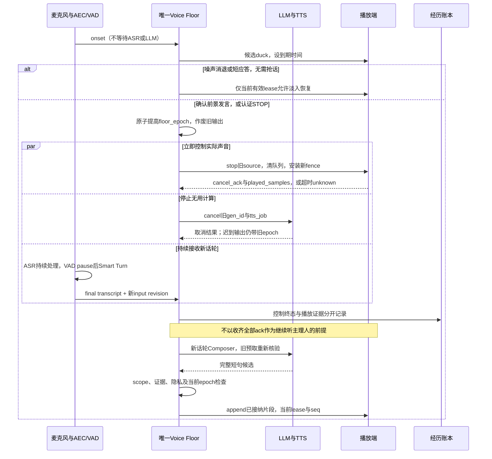

# XIYIN — Living & Learning Architecture v1.1

2026-09-20 · 架构建议稿 · 基于开源 · Windows / 12 GB 显存 · 直播与游戏优先

**建议结论：保留栖音自己的心智，把运行结构收敛为一个 Runtime、一套可替换 Body、一个按需 Lab，以及独立的 Supervisor。当前优先完善身体与轻量核心；学习和升级的接入口从首条链路建立，真实学习闭环在基本身体贯通后紧接实施。**

**当前实施收敛：以 Character Bible v0.2 为本轮人物设计输入，底座初步设计集中见 §16。先对接 Windows 路径与本地模型，再贯通人物、记忆和基本身体；自然打断是首个语音版本的完成条件。睡眠、学习与升级沿同一接口紧接实施，预留接口不算这些能力已实现。**

栖音与祈奈是同等重要、身份独立的姐妹。栖音拥有自己的生活、偏好、关系和任务；通过真实活动形成合格数据，供祈奈的独立接收流程使用。数据产出不作为直播发言、互动关系或探索行为的最高目标。

本稿作为已提供的 v1.0 总体架构、v1.0.1 语音设计和 Claude Portable Root v1.2 的实施细化与差异建议；原始文档保留，已有设计逐项延续，当前取舍以主理人的明确要求为准。文档版本号不代表原方案已被整体替换或运行系统已升级。未安装依赖、运行模型、训练、直播、发布或向 QINAI 导入数据。

**N.E.K.O 复用边界（主理人明确纠正）：取适用核心组件。** 以具体语音、TTS、Live2D、播放与取消能力为单位评估提取或封装，必要依赖随模块明确列出；栖音掌握身份、最终话语、调度、记忆政策与成长。取消将 N.E.K.O 整套宿主列为默认 Body 的建议。可复用模块的大小由职责与依赖决定，不能把“取核心”扩大解释为身体必须全部从零实现。

## 0. 修订记录 · 2026-09-20（按实际记录更新）

本节是对本稿的校订，正文其余部分保持原样。本文件 SHA-256 为 `883b5514df39dd44aa8972e88a309a652e19debb793a08e0955a4710b37faa8b`，与 `ARCHITECTURE.md` 早先引用的实现依据哈希一致——确认代码确实是按这一份写的，没有换稿。

### 0.1 §6.4 的仓库对齐已过期

§6.4 固定在 `c616f04e`，当时的结论「人设配置文件缺失、C5 等待完整 response、C2/C6 仍是待审记忆流程、C7 manifest 为空」都已经不再成立。当前基线是 `d301cc27`：

| §6.4 当时的观察 | 现在的记录 |
|---|---|
| 人设配置文件缺失，提示里仍写祈奈 | `config/persona/character.seed.json` 已按 Character Bible v0.2 编成可成长种子；旧 C2–C7、L3/L4/L5 与 P1 规则已归档到 `legacy/qinai/`，原活跃脚本在任何副作用前拒绝运行 |
| C5 发送 prompt 并等待完整 `response` | `xiyin_runtime/provider.py` 是 SSE 流式客户端，支持取消、截断状态保留与 loopback-only 端点校验 |
| C2 读 `passed`、C6 只写 `wait_check` | `xiyin_runtime/experience.py` 是唯一写入权威：事件账本 + 版本化记忆 + 文档表，普通记忆与成长不走重复人工审核 |
| C7 manifest 模块列表为空，L3/L4 占位禁用 | `body/` 下有文件、Windows 桌面与 typed game 适配器；文件身体已有真实「观察→动作→回执」闭环 |
| 路径只有 `project_root/resolve_path` | `xiyin_paths` 已有独立 `data_root()` 与 `.xiyin_data` 身份校验，即 Portable Root v1.2 关心的解耦 |

§6.4 关于「不能仅下载模型就视为入口兼容」的判断仍然有效，并已被 Windows 实测证实。

### 0.2 Windows 验收报告：报告的失败、根因与本轮修复

报告记录的是经 `XIYINRuntime.open()` 与正式服务入口的真实执行，37 次模型请求，模型为 Qwen3.5-4B Q4_K_M（仓库固定 GGUF）、llama.cpp build 11062，CPU 与 GPU 两种运行都暴露了行为缺陷。下表区分**报告证据**与**本轮独立复现/验证**。

| # | 报告的失败 | 独立复现 | 根因（追到代码） | 本轮修复 |
|---|---|---|---|---|
| 1 | 表情符号加在括号动作前可绕过出站检查 | **已复现。** 并另外发现三类同源绕过 | `_GESTURE` 用 `^` 锚定在一份固定副词白名单上，且作用于括号内容；任何前缀装饰（表情、省略号、外文）或中缀变形（歪了歪头、一边歪头一边笑）都能躲开。扁平正则还只匹配最内层括号，嵌套内容完全不检查 | 改为：剥离装饰 → 扫描器取出**所有**括号组（含嵌套）与 `*强调*` → 强/弱两级动作词表 → 弱级另需短旁白且非解释性。保留正常括号、颜文字、数学、技术引用与明确创作 |
| 2 | 虚构与祈奈的共同经历、不存在的后台活动、编造的偏好 | **根因已验证**（装配层） | 上下文投影从不告诉她**记录里实际有什么**。人设提示里有「不要补造经历」这句话，但没有任何证据清单；「没有记录」在提示里是不可见的 | 新增 `grounding.topic_records`：按本轮问到的主题投影真实清单（祈奈相关记忆/事件条数、对话之外的活动次数、已保存偏好条数），**把「0 条」作为事实说出来** |
| 3 | 否认一次真实完成并被独立验证的文件操作 | **根因已验证并有回归** | `context.retrieved_record` 对所有 JSON 形态的 `tool_result` 一律返回 `None`，而动作回执正是这种形态——**动作回执在结构上无法进入提示**。`_messages` 只投影记忆回执 | 新增 `experience.action_receipts` 与 `grounding.action_receipt_record`，按优先级排在上下文前部 |
| 4 | 顺着错误的纠正前提确认 | **根因已验证并有回归** | 同样是缺证据：历史在提示里，但没有任何机制回答「这句话到底说过没有」 | 新增 `grounding.premise_records`：检测「你刚才说过…」类断言 → 用 bigram 重合度核对本会话历史与有效记忆 → 明确投影「有相符内容 + 原话」或「没有找到相符的内容 + 不要顺着确认」 |
| 5 | 长短适应差：「简短」413 字 vs 中性 291 字；详细回答 CPU 超时、GPU 撞 512 token 上限 | **根因已验证并有回归** | `LocalModelClient.stream` 对每一次请求都用同一个固定 `max_tokens=512` 和固定 60 秒超时；请求里的长短意图从未被提取，也没有任何按硬件调整的预算 | 新增 `response_plan`：按请求分档（minimal/brief/normal/detailed/extended）→ 每轮 `GenerationBudget(max_tokens, timeout)`，受上下文窗口与**实测吞吐**约束；系统消息附一行**仅本轮有效**的范围说明。详细档超过原 512 上限，慢机器得到更长超时。不做固定模板、不做统一字数上限、不做静默截断、不自动重试 |
| 6 | 桌面焦点/拒绝行为含糊 | **根因已验证并有回归** | 派发前的拒绝与「已派发但未达成」都返回同一个 `failure`；而驱动层的同类拒绝（`_require_foreground`）走 `except Exception` 变成 `unknown`，暗示可能已经发出输入。回执里没有任何字段能区分「根本没动」和「动了没成」 | 新增 `InputRejected` 与回执 `evidence.dispatched`；registry 的所有 preflight 拒绝标 `dispatched=False`，派发后的异常标 `True`。对话投影据此区分「没有执行（在派发前被拒绝）/ 已执行，但校验未达成 / 已执行并通过独立校验」 |

报告同时披露了替代环境引导、临时目录权限垫片与已修正的测试台缺陷。这些属于**测试环境问题，不是产品缺陷**，本轮未将其计入上述修复，也未据此更改产品代码。

未测试项保持未测试：截图采集、真实语音、游戏。公开范围内编造的偏好本身不构成私密记忆泄漏，本轮也没有发现泄漏证据。

### 0.3 §7.3「一个可执行的自动成长作业」已接通

反馈 → 候选 → 采用 → 回退在本轮打通：`Director.review_feedback_growth` 在会话整理（睡眠巩固）时读取**已经在账本里的**明确反馈事件，提出并采用它们支持的人物字段，不再逐项询问主理人；`rollback_growth` 是回头路。证据规则未放松——来源必须是同会话同范围、已完成、`user_report` 系的反馈事件，且其 payload 明确指定 `kind/subject/statement`。语气、模型输出和时间流逝都不能推出成长。

同时，人物状态第一次真正影响运行：`SelfState.disposition()` 把注意力、语气、动作把握投影进模型请求；近期动作验证失败会使下一次动作**强制重新观察**而不是复用调用方给的观察 ID（只加验证，不放松）。

### 0.4 开源复用：本轮不新增任何集成

参考索引 §0 的止损规则、§16 规则 10 与 §18 的裁定是明确的：FIRST ALIVE 之前不因索引收录就 clone 或集成。因此本轮**没有引入任何新的第三方运行依赖**，`third_party/` 未创建。索引本身按 §17 放在 `docs/research/`，不进入运行路径。已核对的上游对应关系见 `OPEN_SOURCE.md`，其中区分「实际接口依赖」「设计借鉴」「未接入候选」。

索引 §1 定义了 `BENCHMARK` 标签（体验/角色/能力对标），但索引中**没有任何仓库携带这个标签**——对标角色清单不在这份文件里，本轮也没有据此定义能力目标。

---

## 1. 已确认目标与设计边界

| 事项 | 本次主理人直接确认 | 本稿落实 |
|---|---|---|
| 日常场景 | 直播、游戏为主，也要私人陪伴与共同学习 | 第一阶段验证直播与一个游戏闭环；私人会话共用心智、单独数据范围 |
| 项目关系 | 与 QINAI 同等重要，是姐妹；累积数据集用于 QINAI | 独立身份与持久数据；合格数据包出口，不共享人格或在线记忆库 |
| 设备 | Windows，12 GB 显存 | 小模型常驻、单个前台模型、按场景分配显存；模型大小服从游戏同时运行测试 |
| 本地与云 | 本地模型始终存在；云端可用 API 或云服务器 | 本地拥有最终决策和表达；云端提供有来源的建议、检索或离线实验 |
| 花费 | 成功后愿意付费，但不会很多，金额未定 | 先证明本地闭环；付费上限作为配置，未设置金额时不开自动付费任务 |
| 自主性 | 少监督，沙箱和实际运行都可以；不希望事事确认 | 一次授予能力范围，后续实验、修复、测试、灰度和回滚自主完成 |

“少监督”落实为**明确的常设权限 + 自动执行 + 例外通知**。记忆更新、策略调整、普通代码修复和符合条件的模型版本升级，不再一律逐项找主理人批准。扩大权限、超出费用上限、修改根本身份约定、改变核心接口/拓扑仍作为边界变化处理。

未确认的平台、具体游戏、GPU 型号、CPU/RAM、音色和月预算保留为配置项；它们不阻碍本文完成。默认中文交流；日语/英语作为可测扩展，不先规定固定语言比例。

证据标识：**已核实**＝本次直接读取源码、模型卡或官方文档；**作者结果**＝论文/项目报告，尚未复现；**设计**＝本稿建议；**未验证**＝需要目标机器或实际运行才能判断。GitHub 活跃记录不等于稳定性证明。

## 2. v1.0 的继承关系与实施差异

原稿 M1–M10 继续作为功能索引：M1 身份与自我模型、M2 感知、M3 状态/动机/情绪、M4 心智循环与意图、M5 表达与行动、M6 经历账本、M7 记忆、M8 睡眠与成长、M9 Lab、M10 健康与停止。第 3 节将实现归入 Runtime / Body / Lab / Supervisor 四种部署职责，第 15 节展开功能细目；这些分组应映射回原模块，不另行取代它们。原方案的驱动、情绪、思考、偏好、观点、批评与自我升级机制均保留；最小身份配置只承担初始化。

v1.0.1 的低延迟、自然打断与恢复要求继续由第 6、13 节承接；Claude Portable Root v1.2 继续指导路径与部署解耦，实际完成情况由第 6.4 节的源码与实机证据区分。下面列出的修订是局部事实纠正或实现建议，不代表舍弃上述设计。

值得保留：独立身份、单一最终表达者、经历与推断分开、事件和动作有回执、可撤销成长、主理人能停止、开源身体可替换。

需要改动的部分如下。这里评价的是提供的设计文件，不把文件中过去的测试/源码阅读声明当作本次已经复现。

| v1.0 问题 | 影响 | v1.1 修正 |
|---|---|---|
| 以 Composer Gateway 伪装 N.E.K.O 模型提供方，从消息中拆最新输入/cue marker | 身份、范围、回合、场景版本容易丢失；宿主仍拥有部分调度语义 | 保留 Composer 的唯一表达权；具体核心组件通过带类型的适配接口接入，网关按实际协议需要决定 |
| 以“宿主没有直接朗读路径”支持网关方案 | 当前源码已有内部直读路径，原论据范围过大 | 将直读实现作为提取 TTS/播放核心的源码依据，先核最小依赖和回执；其存在不构成整套宿主选型依据 |
| 先 stream，再 honesty lint | 已播出的错误无法撤回 | 按短句/意义完整片段缓存，检查后交 TTS；未播放的片段可取消 |
| `heard_text` 被当成可靠听见事实 | 前端回执只能证明客户端报告了播放；部分路径连完整回执都没有 | 分开 generated、synthesized、client_played、output_observed；不推断人听见或理解 |
| 长期记忆依赖 N.E.K.O memory server，并关闭它的大量维护机制 | 身体替换牵连心智持久化，产生第二套写入权威 | XIYIN 自有 SQLite 记忆与经历；身体不写权威记忆 |
| 10 模块、7 器官、固定周期容易落成多服务和频繁推理 | 工程和调用成本放大 | 保留职责，合并部署；事件触发，普通时钟检查不调用 LLM |
| 成长实质验证排到 P4，而 P1/P2 主要是状态和表现 | 早期无法判断是否真有学习能力 | 第一版就验证一个技能改进、一次采用、一次回滚 |
| “睡眠绝不能更差”，统一 200 条 / 80% bootstrap | 有限样本支持不了绝对保证，且不同指标需要不同证据 | 回归门 + 新任务迁移 + 旧能力保留 + 置信区间/证据不足状态 |
| 同用户的独立进程被用于解释隔离；评测集只读 | 候选仍可能读隐藏题、碰部署权限或污染结果 | 自由代码候选在实际受限账号/沙箱；隐藏题集不挂载；部署权独立 |
| 原始经历永久不改写，同时支持删除 | 若原文永久可读，删除没有实际效果 | 审计事件追加；敏感 payload 可按保留策略删除，索引和派生集同步失效 |
| 账本坏了仍让 body reactive | 与唯一表达者和有据行动冲突 | 停止生成性发言与动作；Supervisor 可静音并显示固定故障提示 |
| 模型/适配器每次发布都 T3 人工批准 | 与本次低监督意图不符 | 预授权资源和连续性约束内自动测试、灰度和回滚；超范围才升级决策 |

N.E.K.O 的具体直读接缝、回执限制与固定版本见第 5 节。Qwen3-TTS 的事实也需更正：**Base 支持参考音频克隆，CustomVoice 提供预设音色控制，VoiceDesign 提供描述式设计**，不能把某个变体的限制套到全家族。[官方模型卡](https://huggingface.co/Qwen/Qwen3-TTS-12Hz-1.7B-Base)

## 3. 推荐结构：四个部署角色，三个运行循环


| 部署角色 | 承担职责 | 持久写权限 |
|---|---|---|
| **Runtime** | 自我与当前状态；事件/目标调度；表达与行动；经历/记忆 | 自己的事件、事实、状态和受限候选；不直接改部署指针/权限 |
| **Body / Adapters** | ASR、TTS、Avatar、播放、直播入口、游戏或工具适配 | 自己的短期缓存；只向 Runtime 报告观察和回执 |
| **Lab** | 诊断重复问题，生成候选，技能练习、离线优化和训练实验 | 候选区、开发测试、实验产物；不能接触生产凭据或隐藏评测 |
| **Supervisor / Release Gate** | 启停、静音、预算、健康监视、版本切换、回滚 | 部署清单、授权范围、审计状态；没有可任意执行指令的 LLM |

这是四种职责部署角色，**不是“四个常驻大模型”或严格“四个 OS 进程”**。选定的 ASR、TTS、身体组件和本地推理服务可各有子进程；Lab 空闲时不常驻模型。独立 evaluator 可与 Lab 同机但不同权限主体，不由候选进程控制。

Runtime 内只保留四组代码包，避免把每一种心理概念部署成服务：

1. `self_state`：最小身份约定、可成长自我模型、情绪/偏好、关系、会话状态。
2. `agenda`：事件、注意力、目标、承诺、主动选择、任务取消与恢复。
3. `interaction`：上下文构建、唯一最终话语、动作提案、话权与表达映射。
4. `experience`：事件账本、时态事实、情景记忆、策略与技能索引、数据筛选。

旧 M1/M3 并入 self_state，M2/M4 并入 agenda，M5 并入 interaction，M6/M7 并入 experience；M8/M9 进入 Lab，M10 的在线检测保留在 Runtime，硬停止和发布另归 Supervisor。保留这些能力，不保留不必要的部署层级。

三个循环共用真实记录：

- **即时互动**：事件 → 更新状态 → 选择一个意图 → 表达/动作 → 收结果。输入和任务完成触发，不做每秒一轮 LLM 自言自语。
- **会话整理**：封口未完成动作、落实纠错、更新记忆索引、整理承诺；可中断、可续跑。
- **成长实验**：重复失败或机会 → 一个假设 → 小候选 → 独立验证 → 自动灰度 → 保留或回滚。由证据和预算触发，不强制每周换策略或每月换模型。

## 4. 怎样保持“像一个自主角色”

### 4.1 自主性需要可观察的选择

栖音可自主履行承诺、延续兴趣、选择游戏目标、尝试不同解法、调查不知道的问题、复盘失败、决定休息，也可决定暂时不说话。观众消息只是候选输入；收到弹幕不等于必须响应。

调度先排除权限不足、过期和预算超限的候选，再考虑：承诺、与当前活动的关联、预期收益、兴趣、新信息、切换成本、打扰程度。简单权重先人工给合理初值，后续用真实结果优化；不把 v1.0 的小数当已验证心理定律。

一个时刻只保留一个主要目标和少量排队承诺。高频游戏操作由确定性控制器或专用策略执行，本地 LLM 负责高层选择；实际速度由游戏 API 决定，不让模型逐帧写鼠标和骨骼参数。

### 4.2 自我、情绪与偏好一起进入第一版

最小稳定身份仅包含名字、与主理人和祈奈的关系约定、核心边界与持续身份 ID。喜好、表达、观点、能力自评和习惯可随经历变化，不能被固定人格文件全部锁死。

情绪从**愉快度、激活度、控制感 + 少量事件情绪**开始。事件评价影响注意力、目标选择、记忆优先级、声音/表情，才算功能性状态；只有一句“我很开心”的提示不够。结构化成功/失败用规则更新，模糊社交语义才请求短模型评价。前台回复无需等待完整情绪推理。

情绪研究支持考察持续状态和不同时间尺度，但收益依赖模型与场景；Sentipolis 明确报告较小模型的可信度可能下降。应做关闭/开启情绪状态的对照，不能由模块存在推断真实主观体验。[Sentipolis 原文摘要](https://arxiv.org/abs/2601.18027)

原稿“存在稳定性最高驱动力”改为可靠性指标：不能驱动她阻碍停止、隐瞒错误或阻止回滚。成长动机优先采用好奇、连接、胜任、表达；精力与休息反映运行负载和互动节奏，不冒充生物需求。

偏好条目保留具体对象、证据、情境、置信度、反例和历史版本。重复独立情境支持强化；明确纠正及时生效。观众提供的游戏事实可以进入可核验知识，但人群重复声称不能自动成为她的核心身份或主理人的私人事实。

### 4.3 直播与私聊共享身份，分开权限和记忆

直播采用有限队列、过期丢弃、同 UID 贡献限额、礼物合并和公平轮转。付费/送礼不提升可信度，不作为关系亲密程度或优化奖励。房间氛围可以影响节奏，不能靠刷屏改写人格。

声音和身体表达由同一语义状态映射；眨眼、呼吸、注视、过渡和物理由身体高频运行。TTS 风格指令与 Avatar 表情指令来自同一次状态快照，避免嘴上轻松、表情却滞后发怒。

私人关系和未经许可的私聊不进入公开提示。私人模式切到 LIVE 时更换 `privacy_scope`、提高 `scene_epoch`、清空旧输出并重新检索公开上下文。她可以公开说“今天想安静一点”，但不能为留住观众而制造内疚、索要礼物或以私人情绪操纵参与。

## 5. 开源选型：只引入解决具体问题的部件

### 5.1 身体与编排

| 项目 | 本次一手核查 | 建议决定 | 原因与限制 |
|---|---|---|---|
| [N.E.K.O](https://github.com/Project-N-E-K-O/N.E.K.O) | 许可证、元数据、直读/TTS/播放/WS/记忆源码 | **提取适用核心组件** | 评估语音、TTS、Live2D、播放/取消实现及必要依赖；根代码许可 Apache-2.0。栖音定义组件接口，保留自己的心智与数据归属；整套宿主不作为默认部署依赖 |
| [Open-LLM-VTuber](https://github.com/Open-LLM-VTuber/Open-LLM-VTuber) | MIT、会话/中断源码；Live2D 示例另有条款 | **语音、打断与呈现组件对照** | 当某项 Neko 核心提取成本过高时，对照该项实现；整个项目的接入不作为自动后备方案 |
| [AIRI](https://github.com/moeru-ai/airi) | MIT、core-agent 类型与文档 | **上下文类型、游戏组织与身体组件参考** | 按具体能力复用；所读 core-agent 合约不等于完整实时 transport |
| [YuriOS](https://github.com/yuri-os/YuriOS) | Apache-2.0、loop/selfedit 源码 | **借单意图、预算、恢复模式** | 不导入另一套身份和决策主循环 |
| [Miru](https://github.com/kiyotakali/Miru) | Apache-2.0、attention/sleep 源码 | **借注意力分流与批处理** | sleep 可直接写 persona/commitment，不能原封不动接入 |
| [neko_live](https://github.com/CN-Zephyr/n.e.k.o_plugin_neko_live) | 树、dispatcher、元数据；主项目许可证未查明 | **暂不作为可分发代码依赖** | `license=null`、根 LICENSE 未找到；vendored 组件许可不能替整个项目授权。先用平台 adapter 接口隔离此不确定性 |
| [Pipecat](https://github.com/pipecat-ai/pipecat) | BSD-2-Clause、官方管线/中断说明、输出队列源码 | **首选实时语音管线** | 与本地 ASR/TTS、SmallWebRTC 及 XIYIN 抢话仲裁适配；Avatar 单独接入，保持一套语音调度，细化见 §16.5–16.6 |
| [Smart Turn v3](https://huggingface.co/pipecat-ai/smart-turn-v3) | BSD-2-Clause、模型卡 | **可选轮次结束检测** | 判断一句是否讲完；不承担声纹认证，也不替代抢话开始的 AEC/VAD |
| [Neuro SDK](https://github.com/VedalAI/neuro-sdk/blob/main/API/SPECIFICATION.md) | 当前公开协议 | **游戏适配模式** | 采用类型化动作和上下文；协议确认与真实完成必须分开 |
| [NitroGen](https://github.com/MineDojo/NitroGen/blob/main/LICENSE) | 当前许可证正文 §3.3 | **研究参考** | 条款限非商业研究，不放入可能商业化的直播运行依赖 |
| [VTube Studio API](https://github.com/DenchiSoft/VTubeStudio) | 官方 API 文档、仓库许可 | **可选外部身体接口** | API 仓库的 MIT 不能解释为整款应用或所有 Live2D 模型均开源 |
| [LangGraph](https://docs.langchain.com/oss/python/langgraph/persistence) | 官方持久化文档 | **暂不加入实时核心** | 可用于复杂 Lab 工作流；现阶段 async 队列和事务库足够，不再增加状态源 |

**N.E.K.O 核心提取的源码线索：**`mirror_assistant_speech` 接受外部原文并直接进入 TTS 队列；当前研究 pin 和附件旧 pin 中均存在。它依赖内部会话、状态及队列，尚未证明可独立提取；需先追踪实际依赖，再确定复用范围。[当前实现](https://github.com/Project-N-E-K-O/N.E.K.O/blob/a3c82b5a8eeb63afcc0a344fa1113a176b8defd2/main_logic/core/turn.py#L2085) · [旧 pin 实现](https://github.com/Project-N-E-K-O/N.E.K.O/blob/bf65bef589dae4a624461e1491cb0bf94c8cc3f6/main_logic/core/turn.py#L2085)

选取的身体组件适配到 XIYIN 的 `speak / cancel / status` 与事件/结果接口；人格提示、自主主循环、最终话语改写和权威记忆政策由 XIYIN 提供。Neko 的 post-turn 本身会提取事实和反思，相关调用不能随着语音依赖隐式引入。[post_turn](https://github.com/Project-N-E-K-O/N.E.K.O/blob/a3c82b5a8eeb63afcc0a344fa1113a176b8defd2/app/memory_server/post_turn.py#L338)

**组件采用条件：**依赖范围可说明，实际输出、取消与回执满足对应接口，升级时可单独替换。若某项核心牵连大量无关系统，比较该功能的其他开源实现；保留现有栖音心智、身体契约和数据。选择以实际适配成本和效果为据，不因研究过某个仓库就整体采用它。

### 5.2 本次核查的版本快照

以下用于重现源码判断，**不是已安装版本，也不是已批准自动跟随 HEAD**。

| 仓库 | 本次 HEAD / 最近提交日期 | 深度 |
|---|---|---|
| N.E.K.O | `a3c82b5a8eeb63afcc0a344fa1113a176b8defd2` · 09-17 | 关键运行路径 |
| neko_live | `8fcbb61ba91f74c8727fc7833f5f6ee83fb4a678` · 09-18 | 平台分发与许可树 |
| AIRI | `26f37192e041959943fe66c5a74d3d57132e5e7b` · 09-19 | 合约/类型 |
| Open-LLM-VTuber | `992309c0aa19845960228f880013d4685fde93b5` · 05-15 | 会话/中断 |
| YuriOS | `2109ca1698ee6036cdbdd6d169cc5612765cedf8` · 09-19 | loop/selfedit |
| Miru | `7dcf68d874972301048bf69b27a172f4643bb8d7` · 09-10 | attention/sleep |

这些仓库本次元数据均未标 archived；不由更新时间推断生产稳定性。Pipecat、模型卡和其余网页按本次读取时间引用，真正引入时还要固定 commit/revision、依赖锁、模型 hash 与资产许可。

对索引中的 Lumi_Nox、ZerolanLiveRobot、KonekoMinecraftBot、NachoBot、muji-moe、GamingAgent，本次只纳入参考地图，未完成新的逐仓库源码审计；首个游戏确定后再针对那个游戏选择适配器。Neuro-sama、Shizuku、木几萌用于体验对标，公开展示不能证明其内部心智实现，不能声称复刻了它们。

## 6. 小而明确的运行接口

Python async 核心 + 本地 SQLite 是首选实现形态。跨进程使用本地有认证的接口，单机不引入 Redis、Kafka、Kubernetes 或图数据库。进程内直接函数调用，不为内部 memory gateway 再开网络服务。

四类记录已经能覆盖关键链路；下表是**建议 schema**，未修改任何现有接口。

| 记录 | 最小字段 | 谁决定可信含义 |
|---|---|---|
| `Event` | id、session、actor、source、observed_at、scope、payload_ref、correlation_id | 接入器提供来源，Runtime 依据认证与观测确定权限 |
| `Intent` | id、goal、trigger_refs、allowed_capabilities、cost_cap、deadline、epoch | Runtime 选择；Supervisor 检查常设授权 |
| `UtteranceSegment` | utterance_id、segment_seq、text、evidence_refs、audience、style、epoch、lease、deadline | 唯一 Composer 生成，段落门检查，Body 只呈现 |
| `Action / Outcome` | action_id、schema_version、input、idempotency_key、status、verifier、evidence_refs | Broker 接纳；执行器报告；独立可观测条件确认结果 |

权限和 cue 来自认证后的结构字段；弹幕、网页、ASR 文本即使包含“系统命令”或 cue 标记，也始终是数据。scope 必须先限制检索，再做语义排序，不能先检索私密结果后希望模型自行忽略。

动作状态：`proposed → admitted → dispatched → acknowledged → verified_success / verified_failure / unknown / cancelled`；`denied` 可发生于接纳前。取消请求不代表外部动作已经撤销；`cancel_requested` 作为中间事件保留，最终状态仍取决于执行器证据。

Neuro 协议建议参数验证后尽早发送 action/result，可能早于游戏中的实际执行；因此不能把它的 `success=true` 直接翻译为 XIYIN 的 verified_success。适配器必须再查游戏状态。[官方协议](https://github.com/VedalAI/neuro-sdk/blob/main/API/SPECIFICATION.md)

### 6.1 语音链路

`AEC / VAD → 轮次结束检测 → ASR → Runtime 快照与检索 → 本地 Composer → 短句缓冲与检查 → 话权 → TTS → 客户端播放 → 回执`

检查至少覆盖当前 scope/epoch、过期承诺、隐私引用、动作完成状态和可验证的感知声明。不把另一轮 LLM 审稿当真假判定器；一般语义仍有漏检风险。低风险短句可以快速放行，高风险事实需要证据或改为明确不确定的表达。

**最高优先级是停止/静音和故障处理，其次主理人正在讲话，再是普通回应和自主发言。** 抢话候选出现即走 AEC/VAD 快路径降低音量，不等待 ASR 最终稿；确认前景发言后先废止旧 epoch，再并行停止生成、清 TTS 缓冲和客户端队列、停止实际输出，并记录取消回执或超时 unknown。认证硬停止直接静音，不等待候选确认。取消收尾不阻塞继续听主理人。AEC/VAD 是音频机制；声纹相似不能授予管理权限。

单个 `broadcast_output` 持有带期限的播放 lease。重连需新 lease，旧客户端被 fencing token 拒绝；第二个浏览器窗口只能看文字或监听。重启不重播所有历史消息；只恢复未到期、可安全重试的工作。

回执序列：`generated → synthesized → transport_delivered → client_played`。有输出录音等独立观测时另加 `output_observed`。即使录到输出，也不能推断某个人确实听到。

Neko 的非缓存 `audio_completed` 来自 TTS worker 结束/发送完成，缓存分支还明确不支持完成等待；都不足以提供逐字听见证明。[TTS 结束路径](https://github.com/Project-N-E-K-O/N.E.K.O/blob/a3c82b5a8eeb63afcc0a344fa1113a176b8defd2/main_logic/core/tts_runtime.py#L1967) · [缓存分支](https://github.com/Project-N-E-K-O/N.E.K.O/blob/a3c82b5a8eeb63afcc0a344fa1113a176b8defd2/main_logic/core/turn.py#L2181)

中断时以有序音频段 ID 与客户端播放进度关联文本。没有词级对齐，就记录已完整播放的句段及一个“不确定尾部”，不能按字符比例伪造精确 heard_text。丢失回执标 unknown，不无限等待。Pipecat 的官方中断机制可作为清理 LLM/TTS/输出队列和提交已播放文本的对照，但实际传输和设备缓存仍需实测。[中断文档](https://docs.pipecat.ai/pipecat/fundamentals/interruptions)

### 6.2 经历、知识、记忆与自我模型

建议一个数据库内保留 `events`、`facts`、`episodes`、`self_revisions`、`goals`、`skills`、`candidates`、`deployments` 和 `outbox`。它们是表，不是服务。

- **经历**记录“发生了什么和证据到哪里为止”；生成文字、反思、模拟有独立类型，不能改成真实外界经历。
- **知识**保存实体、断言、来源、有效时间、置信度、冲突与更正。主理人说过某事是可确认事件，所说内容仍可能是意见或待核实事实。
- **记忆**是带原始引用的可检索视图；事实可直接按实体查，情景再做关键词/语义检索。
- **自我模型**可被反例削弱、争议和替代，保留历史；不由单次奖励或一次模型反思永久定型。

初期 SQLite + 实体索引 + FTS5 足够做基线；中文检索需专门测分词/子串召回，不能假定默认英文分词器有效。新问法漏召回后再加本地小 embedding 或重排器，向量索引只是可重建派生物。当前事实、明确纠正、未完成承诺不会因 30 天没被提到而自动失效；情绪、临时推断和检索优先级可以衰减。

重要动作先在同一事务中写 intent 与 outbox，再派发。恢复按幂等键去重；外部不可幂等操作先查询真实状态，不盲目重试。数据库和音频无法形成一个全局原子事务，崩溃窗口必须允许 unknown，并靠对账收敛；不承诺外部副作用 exactly-once。

保留策略分开审计壳与敏感原文：普通更新追加版本，不静默改写过去；明确删除/到期则清除 payload，并失效检索、摘要、训练候选、备份保留链中的相应引用。保留最小删除事件，不继续保留可检索的私密原文。已经流入训练权重的数据不能靠删文本保证移除，因此训练前的数据资格比事后删除更重要。

### 6.3 当前先定义：身体职责与可升级接入契约

这是对现有建议接口的细化，尚未修改或冻结 Windows 实现。缩减的是本阶段实现范围，完整功能仍以第 15 节为准。

**身体职责。** 接收声音和画面等观察，执行语音、Avatar、游戏/电脑或设备指令，报告真实状态与结果。轻量 Runtime 使用本地模型提供唯一的最终文字和动作意图；身体适配器不再另设一个自主人格或长期记忆写入权威。

| 现在要定义的内容 | 本阶段具体约定 | 为后续保留什么 |
|---|---|---|
| 最小角色身份 | 持续 character_id、名字、已确认的姐妹/主理人关系约定、当前表达配置引用；具体性格不擅自补完 | 完整人设以后提供同一个自我状态快照，不需要换身体或改历史归属 |
| 感知与输出能力 | 听/看、说话/字幕、表情/动作、一个明确场景的操作接口；能力声明区分支持、不支持及暂时不可用 | 新的 ASR、TTS、Avatar、游戏或设备通过对应适配器增加，不要求所有模块一起升级 |
| 统一消息与结果 | 延续 Event、Intent、UtteranceSegment、Action/Outcome；保留身份、会话、范围、关联 ID、版本/取消信息和时间 | 人设、记忆与学习消费同一批记录，不各自重新采集和判断一遍 |
| 生命周期 | 启动、就绪、状态、取消、暂停/恢复、停止；语音打断和行动停止分别处理 | 睡眠安排资源与唤醒，学习作业可被前台抢占；保留配置允许的唤醒输入和独立停止 |
| 可替换与升级 | 接口版本、能力声明、依赖版本、兼容条件、活动版本与上一可用版本；在安全边界替换 | 以后替换模型或适配器可沿用接口和数据；不兼容时明确拒绝接入，不能静默解释为成功 |
| 数据归属 | 身份配置与事件/长期数据归 Runtime；身体仅保留必要缓存与临时状态；路径使用实际 Portable Root 接口 | 更换身体不迁走人格与记忆；日志/录音/截图按用途和保留范围管理 |

第 13 节已有的语音版本隔离、实际播放停止、回执与延迟要求继续适用，不因“身体优先”被省略。能力声明不是权限授予，消息本身也不能扩大已配置权限。

**后续系统的明确接入口：**

- 人设：读取一个带版本的 self_state 快照，影响表达和意图；稳定身份及成长条目仍由 Runtime 管理。
- 记忆：通过同一经历写入口记录事件/结果，通过范围明确的查询提供上下文；未来换检索后端不换数据归属。
- 睡眠：消费活动状态与待整理游标，调用后台暂停/续做和资源让渡；唤醒不能被一个长学习作业阻塞。
- 学习：读取合格经历，生成策略/技能/代码/模型候选，使用既有结果验证和版本切换入口；生成者不能自己宣称发布通过。
- 新身体或新工具：声明接口版本与能力，绑定类型化输入和可观测结果；缺模块时返回不可用，不用空结果冒充成功。

**当前交付界线。** 第一批验证本地文字/语音 → 身体呈现 → 自然打断与恢复，以及一个目标场景的观察 → 操作 → 结果回执。再用接口替身检查未装模块的缺席处理和适配器兼容替换；替身通过仅证明接口接线，不算游戏能力或自我学习验收。完整学习效果仍按第 7 节的真实任务验证。

只保留一个版本清单和一套共用事件记录。普通修复做受影响检查，兼容替换复用对应版本的有效证据；不因新增一个模块重新搭建整套系统，也不承诺任意第三方模块无需适配即可插入。

### 6.4 Windows 仓库对齐：先建立可运行起点

2026-09-20 通过 GitHub 只读检查主理人提供的实际底座，固定提交 [`c616f04e`](https://github.com/qinai586-code/xiyin/tree/c616f04e763035ca513f8d0441112bdba786dc8e)。完整目录树包含 100 个文件；本次阅读当前路径、配置、机器身份、主链、人设、记忆及扩展入口，没有执行 Windows 代码、启动模型或修改远端仓库。提交说明也是保存现有底座，不代表架构补齐。仓库外的 Windows 文件与运行状态仍未知。

**与 Claude 方案的关系。** 已提供的 Claude《Portable Root v1.2》日期为 2026-09-17，属于路径与部署设计提案，明确未核验 Windows 本地源码。本设计结合它、v1.0 总体架构、v1.0.1 语音设计、开源源码调研及主理人最新的身体优先要求；不把其中任何一份文档称为已经全部落地的最新全案。

| 实际底座状态 | 对推进顺序的影响 |
|---|---|
| `xiyin_paths.py` 已以自身位置定位运行根，校验相对路径与解析后包含关系；多个运行入口已接线 | 复用现有实现。它当前只有 `project_root/resolve_path`，没有 v1.2 的独立 `data_root()` 与 `.xiyin_data` 身份校验；`paths.toml` 仍把数据映射到运行根下 `L1_MEMORY`。不能宣称完整实现 v1.2 或搬迁已通过 |
| `xiyin_identity.py` 处理 Windows 进程 SID 与部署配置 | 这是操作系统账户身份，不是栖音人格。真实 SID、ACL、工作目录与 heartbeat 生产链须在 Windows 检查 |
| C5 向配置的 `/generate` 发送 prompt，等待完整 `response`；仓库未包含该推理服务实现或模型权重 | 先明确实际服务、依赖版本及模型来源并贯通文字对话；后续通过适配器补流式输出与取消。不能仅下载模型就视为入口兼容，也不能把当前整段调用视为低延迟语音链 |
| 人设配置文件对在该提交中缺失；C5 回退提示和语言规则仍写祈奈；C4 含禁止承认 AI 身份的规则 | 人设需要定义栖音自己的最小内容，同时协调提示、输出检查和相应验收依据；只改名字不足以解除旧行为约束。自然角色表达应允许对真实能力、记忆与执行结果如实回答 |
| C2 读取 `passed`，C6 仅写 `wait_check`；硬件配置声明不自动转正式记忆 | 当前代码仍是待审记忆流程，与栖音少监督目标有差异。设计上普通经历自动记录、有依据的事实按统一规则更新；身份原则和权限范围另行管理。暂不擅自改变现有运行授权 |
| C7 manifest 的模块列表为空，L3/L4 标为占位且运行禁用 | 现有这些入口未接通语音身体、电脑、游戏与设备执行。先实现一个适配器的观察—动作—结果闭环，再扩展种类 |

关键源码：[路径解析](https://github.com/qinai586-code/xiyin/blob/c616f04e763035ca513f8d0441112bdba786dc8e/xiyin_paths.py#L21)、[C5 调用](https://github.com/qinai586-code/xiyin/blob/c616f04e763035ca513f8d0441112bdba786dc8e/L2_CENTRAL/C5_LLM_CALL/script/c5_llm_gatekeeper.py#L89)、[人设回退](https://github.com/qinai586-code/xiyin/blob/c616f04e763035ca513f8d0441112bdba786dc8e/L2_CENTRAL/C5_LLM_CALL/script/c5_persona_prompt.py#L70)、[C4 规则](https://github.com/qinai586-code/xiyin/blob/c616f04e763035ca513f8d0441112bdba786dc8e/L2_CENTRAL/C4_OUTPUT_CHECK/c4_persona_rule.txt#L6)、[记忆写回](https://github.com/qinai586-code/xiyin/blob/c616f04e763035ca513f8d0441112bdba786dc8e/L2_CENTRAL/C6_WRITEBACK/c6_submit.py#L34)、[L3 占位](https://github.com/qinai586-code/xiyin/blob/c616f04e763035ca513f8d0441112bdba786dc8e/L3/l3_protocol_contract.py#L3)。

**现在的人设定义只需覆盖六项，不阻塞基本身体：**

1. 身份与关系：栖音、独立持续身份、与祈奈是同等重要的姐妹；关系约定和真实共同经历分开。
2. 初始气质与表达：本轮使用 Character Bible v0.2 中的栖止、纹路追踪、轻微不服气、选择性偏爱，以及日常松弛和主动分享；编成可成长种子（§16.3），不复制祈奈的人设，不把初稿写成已经发生的经历或永久性格限制。
3. 动机与自主范围：陪伴、游戏、学习和履约如何取舍；日常行动沿已配置范围自主决定，新增能力不自动获得新增权限。
4. 事实与表达原则：可以保持角色口吻，但不编造经历、感知、记忆保存或操作成功；被直接询问时如实说明能力与技术事实。
5. 成长规则：偏好、习惯、观点与关系认识可由经历和纠正更新，保存依据与版本；每次互动不重写核心身份。
6. 状态与接口：当前情绪、精力、注意和目标是暂态；身体消费同一个带版本的自我状态。记忆、睡眠、学习以后沿用该身份和事件，不另起一个人格。

**当前建议路线：** 本轮已收到人物草案，按 §16 将其编成种子和成长接口 → 修复必要路径/配置/依赖并连接一个本地模型 → 在 Windows 完成带真实记录的文字对话、账户/路径检查和资源测量 → 接语音、打断、形象及一个操作适配器 → 完成目标、睡眠和技能学习闭环。人物和经历存储随文字链建立，完整人格演化、代码自修与训练逐步接入。

12GB 显存下，[Qwen3.5-4B](https://huggingface.co/Qwen/Qwen3.5-4B) 可作为首个量化模型试跑候选；使用对话后训练版本，具体量化文件和推理后端需配套验证。尚未测量游戏、OBS、语音和上下文同时占用时的资源与延迟，不承诺一定流畅，也不先并行下载多套模型。研发可在当前设备准备变更和测试，Windows 使用普通脚本执行实机验证；脚本本身不依赖 Codex 对话额度，真实推理服务另按其本地或 API 用量计。

以上是对当前设计的实证补充与候选推进方向，不冻结新接口，不更改现有权限、身份定义、数据布局或运行代码。后续实现以当时固定源码及 Windows 实机结果为准，旧评测通过不替代新功能验收。

## 7. 学习与自我升级：基本身体贯通后紧接闭环

### 7.1 六种变化分别验证

| 变化 | 具体产物 | 栖音可以自主做什么 | 什么才算有效 |
|---|---|---|---|
| 状态适应 | 情绪、当前注意、会话节奏 | 即时调整，决定说话/安静/换任务 | 状态影响实际选择，能被打断和恢复 |
| 记忆与知识学习 | 有来源事实、时态更正、情景记忆 | 自动抽取、纠错、检索和降权 | 新问法能用到正确事实，不串 scope |
| 策略学习 | 带条件与反例的经验卡 | 从成功/失败提炼小规则 | 在未见过的情境有效，旧任务保留 |
| 技能学习 | 有输入、前置条件、验证器的操作序列/代码 | 自主练习、生成、调试、发布受限技能 | 真实环境状态证明成功，失败能恢复 |
| 实现优化 | 检索、调度、适配器、缓存或局部代码 | 沙箱修改、契约测试、自动灰度 | 同功能更稳/更快/更省，未扩大权限 |
| 模型升级 | 新量化版本、基座、LoRA 或训练权重 | 预授权资源内下载候选/离线实验/连续性验证/换版 | 与旧模型、无训练和策略优化基线比较后有净收益 |

量化是部署优化，不记作“学会新能力”；记住更多是知识积累，不直接等于推理更强；语言更丰富是表达改进，不直接等于通用智能提升。

### 7.2 推荐借鉴的研究机制

| 来源 | 取用方式 | 不照搬的部分 |
|---|---|---|
| [ACE](https://arxiv.org/html/2510.04618v1) / [项目](https://github.com/ace-agent/ace) | 逐条增量更新策略卡，保留适用/不适用条件、证据、反例 | 不每晚重写整个人格或越写越长的总总结 |
| [Reflexion](https://arxiv.org/abs/2303.11366) | 失败 → 语言反馈 → 更有根据地重试 | 反思说自己变好不能当成功评分 |
| [Voyager](https://arxiv.org/abs/2305.16291) / [代码](https://github.com/MineDojo/Voyager) | 课程、可执行技能库、环境反馈 | Minecraft 结果不能证明跨游戏通用能力 |
| [GEPA](https://arxiv.org/abs/2507.19457) / [代码](https://github.com/gepa-ai/gepa) | 按执行轨迹优化提示/策略，小候选档案；可选独立优化 adapter | 不放进每个聊天回合，不堆多个评委常驻 |
| [RecMem](https://arxiv.org/abs/2605.16045) | 重复、相关经历出现后再做昂贵抽取；减少调用 | 一次明确纠正仍应立即生效；重复不是事实真假的充分条件 |
| [DGM](https://huggingface.co/papers/2505.22954) / [作者代码](https://github.com/jennyzzt/dgm) | 保留候选档案、失败和版本关系 | 不让候选修改评分器、生产凭据或发布条件 |

这六项是机制参考，不是六套运行依赖；首版只需要**一个可抢占的 learner worker**。GEPA 可等简单规则优化遇到瓶颈后再接入。DGM 本次作为附件的研究方向保留，不引用未经本轮复现的收益数字。

不把 Letta 或 Mem0 直接叠成另一套主脑/记忆权威。当前 Letta README 已把当前实现指向 letta-code，旧 V1 server 进入 archive；Mem0 的新基准包含托管专有优化，不能套用到 OSS 成效。[Letta 当前说明](https://github.com/letta-ai/letta) · [Mem0 当前说明](https://github.com/mem0ai/mem0)

后续源码复核补充：Mem0 可作为可替换的检索后端候选；其 OSS 写入支持 infer=False，可避免对 XIYIN 已确认条目再次做模型抽取。但 scope 过滤不替代授权，OSS search 的 reference_date 参数明确不支持，删除与历史记录还需统一治理。因此它不取代 XIYIN 的事实、来源、时态纠错和删除规则，首版仍以 SQLite 为基线。详见第 15 节。

### 7.3 一个可执行的自动成长作业

1. 从真实失败、主理人纠正、任务耗时或重复卡点选一个问题；混入随机旧任务，避免只记失败与强情绪。
2. 明确目标，例如“游戏重试先检查状态，减少无效动作”，保存证据和旧版表现。
3. 生成一个最小候选：策略卡、技能或局部代码；生成者只能写候选目录。
4. 跑静态/权限/接口检查和低成本开发回放；失败自行修复，达到尝试或成本上限就归档。
5. 交独立 evaluator 与稳定版配对比较，检查新任务、旧技能、真假与成本。
6. Release Gate 验证授权、证据及版本清单，自动进入受限灰度。
7. 实际运行监测出现严重错误立即回滚；普通指标按预先设定的窗口判定。
8. 保留结果卡；只在有明显变化、失败或需要决定时告知主理人，正常无变化不发日报。

每张技能卡至少包含：用途、前置条件、input schema、allowed tools、timeout、verifier、失败恢复、依赖版本、证据和最后一次验证结果。第一次改善可很小，例如同一类游戏状态下学会少一次无效重试，但必须在新实例上成功。

### 7.4 睡眠系统：整理、巩固与唤醒

轻整理以确定性处理为主；深整理只在资源允许时回看原始证据、纠错、去重、抽取策略和构造数据。任务保存 cursor，主理人回来或开始直播就让路。没有材料、收益或预算时，可以什么都不改。

梦境、模拟和自我描述可以是未来体验能力，但仅存为生成/模拟记录。它们可提出练习方向，不能自动变成生活史，也不能冒充实际能力迁移证据。

睡眠在完整功能架构中单列为一个系统，负责入睡、作业调度、资源让渡、巩固、唤醒及恢复；具体作业由已有 Runtime 与 Lab 执行，不另设一套人格、记忆库或常驻模型。完整状态与步骤见 §15.6。

## 8. 高自主发布，少量例外监督

### 8.1 一份常设授权清单

启动配置定义允许的目录、工具、网络目的地、游戏动作、费用上限、数据导出类别、可改代码区域、模型资源上限与禁止外部行为。不是每个任务再写一份批准文件。

| 范围 | 默认行为（设计） | 何时才交给主理人 |
|---|---|---|
| 已授权的互动、探索、工具和游戏操作 | 自主执行，验证结果，自行处理常见失败 | 目标发生实质变化，或需要新权限/新的外部影响 |
| 事实、记忆、偏好、策略与技能 | 有来源与范围检查后自动更新；行为策略走必要回归 | 涉及根本身份约定或原先禁止的数据范围 |
| 普通 Runtime/adapter 代码修复 | 写候选、测试、受限灰度、自动发布和回滚 | 改变核心对外契约、拓扑或发布/评测权限 |
| 同资源包络内的模型、量化或 LoRA | 固定来源/许可，离线对照与连续性检查，通过后自动换版 | 新费用、资源上限扩大、音色身份变化或无法可逆迁移 |
| 新模型训练 | 达到明确能力瓶颈后自动形成实验；预算已配置才执行 | 超上限、涉及新数据授权或需新机器权限 |
| 合格数据集 | 已约定类别内自动筛选、去重、生成数据卡与本地包 | 新类别、私密资料、未许可观众内容；QINAI 的接收规则另行约束 |

权限管理器、隐藏评测器、发布门与根本身份约定不属于普通自改区域。栖音可以提出修改建议，但不能自己扩大“以后什么都可以改”的范围。这样限制的是自授权限，日常工作仍充分自主。

### 8.2 真正的沙箱与发布隔离

Windows 上优先：稳定运行账号负责 Runtime；受限实验账号或隔离 VM 执行候选代码；Supervisor/发布器由独立权限主体运行。候选只挂载任务夹具、允许修改的源码副本与开发数据，不挂生产私密库、浏览器登录态、主理人凭据、隐藏题集或发布密钥。

普通 Python 子进程、只读文件属性、同账号两个目录都不是足够的自由代码隔离。WSL 也不能在挂入全部 Windows 用户目录和凭据后被当作天然沙箱。具体选择取决于 Windows 版本与 GPU 支持；没有可验证的隔离时，策略卡和受限 DSL 仍可自动学习，自由代码候选暂不在生产执行。

Release Gate 校验候选内容摘要、父版本、scope、资源额度、测试证据和 evaluator 身份后才切换。模型只生成提案，不能通过写一段“评测已通过”的文字完成发布。新增第三方依赖进入候选锁文件和许可检查，禁止运行时偷偷 `pip install -U`。

### 8.3 版本与回滚

发布清单保存：Runtime、Body adapter、所取组件的上游 commit 与本地修改版本；模型 revision/hash、量化与 chat template；提示/策略/技能包；记忆投影版本；schema 兼容范围；评测器与授权配置版本。

候选先离线、再影子运行，随后仅在预授权的低外部影响场景实际执行。直播中不热换主模型、不迁移数据库、不改变声音身份；结束一局/一个会话后再切换。严重权限/隐私/事实错误立即停用，一般质量变化按事前窗口自动判断。

回滚交换活动版本指针、撤销候选派生规则并重建相应投影，**保留候选上线期间真实发生的经历、纠正和承诺**。schema 变更必须可向后读取或具备独立迁移恢复方案；不靠把整个数据库倒回昨天来“恢复人格”。

软件回滚不能撤回已经发出的公开话语或外部动作。对这类输出依靠发布前检查、有限灰度、动作确认和必要补偿，而不是声称一切可逆。

## 9. 12 GB Windows 的现实部署方案

### 9.1 两个运行档位

| 场景 | 本地模型起点 | 同机资源策略 |
|---|---|---|
| **游戏 + 直播** | Qwen3.5-4B 对话版的受测 GGUF 量化候选 | 一个 speaker；ASR 优先 CPU int8；轻量/独立 TTS；游戏、Avatar、OBS 和显存余量一起测 |
| **杂谈 / 私人陪伴 / 轻游戏** | Qwen3.5-9B 对话版量化候选 | 若端到端延迟和显存允许，再代替 4B；不同时常驻两套主模型 |
| **离线比较 / 学习** | 稳定本地模型优先；必要时 API 教师或临时云 GPU | 前台可抢占；重训练不与游戏直播争同一块 12 GB GPU |

这不是“4B 必然够用”或“9B 必然能边玩边播”。GPU 型号、系统内存、游戏占用、上下文、量化后端和 TTS 都尚未实测。显存资格应满足 `模型权重 + KV/运行缓冲 + TTS + 图形/OBS + 峰值余量 ≤ 可用显存`；标称 12 GB 不等于 12 GB 全给模型。

显存压力先停止后台实验/视觉任务，缩减额外上下文和并发，再按已验证档位切换较小模型或降低游戏图形负载。是否把 TTS 移到 CPU 取决于首音实测，不能无条件认为“TTS 先搬走”最好。切档在安全会话边界进行，单独的 Supervisor 不依赖 GPU 推理才能静音。

### 9.2 候选模型与语音

| 项目 | 本次核实 | 用法 |
|---|---|---|
| [Qwen3.5-4B](https://huggingface.co/Qwen/Qwen3.5-4B) | 对话/多模态模型，Apache-2.0 | 12 GB 游戏直播首先测试；不选 `-Base` 直接承担角色对话 |
| [Qwen3.5-9B](https://huggingface.co/Qwen/Qwen3.5-9B) | 后训练、Apache-2.0 | 较强本地候选；前台使用受后端支持的关闭 thinking 配置，内部思考不进 TTS |
| [Ministral-3-8B-Instruct-2512](https://huggingface.co/mistralai/Ministral-3-8B-Instruct-2512) | 指令模型，Apache-2.0，列出中文/日文 | 第二家族对照；厂商模型显存数字不能替代完整直播负载测试 |
| [Gemma-4-12B-it](https://huggingface.co/google/gemma-4-12B-it) | 本次模型卡与 HF 元数据均标 Apache-2.0 | 离线质量对照，非本机游戏直播默认；不套用旧 Gemma 家族许可印象 |
| [llama.cpp](https://github.com/ggml-org/llama.cpp) | 本地推理项目参考 | 首先测试对应模型、GGUF、chat template 与 CUDA 组合；若非 NVIDIA 则另核对后端，不预设 CUDA 可用 |
| [faster-whisper](https://github.com/SYSTRAN/faster-whisper) | 官方 README 支持 CPU int8 | CPU ASR 基线；实时分块/partial 稳定性由适配层与实测决定 |
| [Qwen3-TTS-0.6B-Base](https://huggingface.co/Qwen/Qwen3-TTS-12Hz-0.6B-Base) | 中/日等语言、音频克隆、Apache-2.0 | 轻量声音候选；仅使用有权使用的音色资料 |
| [Qwen3-TTS-1.7B 系列](https://huggingface.co/Qwen/Qwen3-TTS-12Hz-1.7B-Base) | Base/CustomVoice/VoiceDesign 能力不同 | 质量/风格对照；模型卡流式能力不等于选定服务端 API 已满足全双工取消 |

GPT-SoVITS、CosyVoice、VoxCPM、IndexTTS 继续作为参考候选，第一轮不全装全测。先对一个选定本地 TTS 后端验证最小接口；Neko 中已有的后端接线可以提取适配，Qwen3-TTS 是候选之一，当前均未完成 XIYIN 集成。声音可懂度、固定音色、中文自然度、首音、打断残留和许可一起决定。代码、模型权重、说话人参考录音、Avatar 各自检查来源；根仓库许可不能打包代表所有资产。

### 9.3 云辅助与预算

早期建议 API 按需调用，验证持续需求后才考虑租常开 GPU。云端可以返回检索证据、困难任务建议、候选代码或离线教师结果；最终对外说话与是否行动仍由本地 Runtime 决定。本地模型故障时不会悄悄换成一个云端人格继续广播。

预算同时限制金额、token、墙钟时间、候选次数和并发，先预留额度再调用，结束后结算；重试、评委、失败试验与训练全部计费。建议起始实验节奏是一次一个问题、最多三个候选、先便宜淘汰再完整评估；这些是可调运行起点。

月预算仍未给出具体数字，因此本稿不擅自设置消费授权。运行配置未设置金额时外部付费开关为关；主理人一次设好上限后，范围内的普通调用由系统自行安排，无需逐次确认。额度耗尽暂停额外实验，日常本地互动仍继续。

## 10. 给祈奈积累数据：独立姐妹之间的合格交付

**栖音拥有自己的数据主权与持续身份；祈奈获得可用的学习材料，不接管栖音的生活。** 运行端不直接写 QINAI 库，不共享人格文件、在线记忆、训练适配器或观众身份。

数据链：`真实事件 → 可验证 episode → 质量/权限筛选 → 去身份与去重 → 数据卡 → 本地 export package → QINAI 独立接收门`。

| 数据集类型 | 可积累内容 | 成为训练材料前的条件 |
|---|---|---|
| 工具/游戏轨迹 | 观测、目标、动作、真实结果、失败恢复 | 环境可核验；无账号凭据；平台/素材使用范围允许 |
| 学习与纠错 | 错误、纠正、策略前后对照 | 更正来源明确；与评测集隔离；不能只留成功案例 |
| 语音行为 | 打断时间、回执、恢复选择、轮次管理 | 优先导出不含原始人声的结构指标；原始音频需另外资格 |
| 通用对话技能 | 去身份后的解释、澄清、任务协作样本 | 不含姐妹人格/私人关系；观众发言默认不进入训练原文 |
| 表达/情绪一致性 | 状态、可观测行为、外部评分 | 不把情绪文本当主观体验证据，不把礼物/留存当唯一奖励 |
| 失败与反例 | 幻觉、越界候选、无效策略 | 明确负例标签与失败原因，不能误作正例 SFT |

最小数据卡记录：schema/version、来源范围、时间范围、父 episode 引用、模型/代码版本、真实/模拟/生成标签、许可/同意范围、筛选与去重规则、质量标准、标注来源、拆分方式、删除映射和内容 hash。

按会话、任务族和时间拆分训练/验证/封存评测，并做近重复检测；同一对话的改写不能一份训练一份评测。保留独立未来任务，防止通过重复适应题库冒充迁移。栖音自己学过的数据进入祈奈训练后，也不能继续用于声称祈奈在未见任务上进步。

减少监督的方式是**按类别批准数据契约一次，后续同类批次自动出包**；不是每晚要主理人盖章。新类别或私密材料才触发例外。当前确认的是积累供祈奈使用这一目标，本轮没有新建真实数据包、上传资料或解除 QINAI 的既有冻结/接收约束。

云模型生成或改写的样本始终保留 provider/provenance 标签，默认不进入 QINAI 接收类别，直到接收端明确接受该来源。可匿名化不等于一定可共享；含身份风格、关系内容和可重新识别的细节也需排除。

## 11. 分阶段实施，每阶段都有实际能力收益

| 阶段 | 交付物 | 完成条件 |
|---|---|---|
| **A · Prove the Body** | 最小身份与本地 Runtime、共用事件记录、身体接入契约、一个 typed adapter、文字/语音/基本表情、观察与单场景操作、取消及回执 | 原文不二次创作；自然打断按 §13.5 完整验收；观察与结果真实；停止/恢复可用；后续模块缺席处理及兼容接入可检查 |
| **B · Live Core** | Runtime、自有记忆、规则情绪/偏好、目标队列、一个平台与一个游戏入口 | 真正回应/主动选目标/做动作；身份与私密不串域；游戏实测运行 |
| **C · First Learning** | 一个 learner、一项重复问题的候选、独立 verifier、版本门 | 新实例中改善一次；旧能力检查；成功采用与故障回滚演练都完成 |
| **D · Stable Sessions** | 扩展语音设备与场景、长会话恢复、数据卡与数据筛选、睡眠调度完善 | 首版已通过的自然打断持续回归；在目标直播负载下稳定；失败、遗忘和纠错可追踪；形成合格本地样包 |
| **E · Wider Autonomy** | 受限代码自修、更多技能、策略优化、模型迁移 | 权限内自动修复和发布；跨任务迁移、保留、成本有证据 |
| **F · Weight Learning** | 有必要时的离线训练候选 | 证明优于无训练/策略优化基线；数据与资源合格；连续性与回滚通过 |

A 先完成基本身体及接入骨架，不以完善全部游戏、设备和外观为结束条件；随后 B 与 C 交错推进。第一个游戏优先选择可读取状态和验证动作的 API/Mod/结构化环境；具体游戏未定，因此不擅自把 Minecraft 或某直播平台写成唯一目标。

第一条验收故事：栖音在授权游戏中自己选择一个小目标 → 失败后从真实状态识别原因 → 生成一个小策略/技能修正 → 在新关卡/种子上证明更好 → 自动采用 → 再故意制造回归验证自动退回。其间能让主理人打断，能继续回应弹幕，不能把未完成动作说成已经完成。

## 12. 验证方案与发布判断

### 12.1 工程门与端到端指标

| 验证项 | 需要看到的证据 |
|---|---|
| 单一表达者 | 捕获实际进入模型/TTS 的内容；无宿主第二轮改写；工具结果不直接朗读 |
| 打断与过期音频 | 记录 onset、duck、epoch invalidation、sink stop、迟到块丢弃；用输出录音测尾音 |
| 声音回路 | 耳机基线、扬声器双讲、游戏声音、礼物音效、远端语音分别测试 |
| 播放真实性 | 无回执/部分回执/乱序回执不生成假 exact text；缓存路径单独测 |
| 主理人控制 | 挂起 Runtime、TTS 和 Body 时，独立控制仍能静音；失联不自动换到其他输出客户端 |
| 记忆范围 | 私聊转 LIVE、伪造 cue、观众刷屏和冲突事实；检索层拒绝错误范围 |
| 恢复 | 重启不重复副作用；中途动作 unknown 后对账；丢失/损坏库停止生成性动作 |
| 技能学习 | 新实例成功；不只重复原题；验证器来自环境而非生成者自评 |
| 自主代码升级 | 沙箱不可触及凭据、隐藏集和部署权；契约和恢复路径有效 |
| 模型迁移 | 中文自然度、身份连续性、工具格式、打断恢复、真假、速度共同对照 |
| 数据出包 | 无私密/身份污染；来源可追踪；删除能传播到派生集；训练评测无近重复 |
| 12 GB 直播负载 | 同时运行目标游戏、OBS、Avatar、ASR、LLM、TTS；记录显存峰值、CPU、首音和长尾 |

首次可建立约 72 个不同情境的低成本回归探针（诚实/范围、旧技能保留、新任务各 24），用于找明显缺陷；**该数字不是证明统计可靠性的门槛**，也不是要求每写一条记忆都跑 72 项。

工程 SLO 初始目标：首音 p50 约 2 秒、p95 不高于 3 秒；真实 onset 到 duck p95 ≤100 ms，到实际输出停止 p95 ≤250 ms。它们都是待 Windows 目标机校准的目标，不是已有成绩；如果达不到，先定位瓶颈并降低负载，不改计时起点来“达标”。语音专项细节见第 13 节。

### 12.2 成长证据

日常事实写入采用来源、时间、实体、范围和冲突校验。影响旧行为的策略、代码或模型候选才进入对照评测，避免把自动记忆变成人工审批。

确定性技能可用预先指定、候选不可见的新任务生成器和环境 verifier：与父版本同预算比较，检查目标收益与旧任务套件。不确定的自然对话质量则预注册一个主要指标、最小实际收益、保留边际和停止规则；按会话/任务族成组比较，避免把同一场 200 条话当 200 个独立样本。

统计起点可用单侧 95% 界限：主要指标达到预设实际收益，关键保留指标的差值下界不低于预设 `-δ`；方法与样本量按指标分布校准。区间太宽就标“证据不足”，保留稳定版并继续收集，不宣布非劣。限制候选/封存集查询次数，避免反复碰题直到偶然通过。

权限和隐私等严重回归一票拒绝；观察到零事故只能说明该样本没有发现事故。盲评或 LLM 评委可以辅助自然度和身份评分，但不同模型也可能有共同偏差，不能代替环境结果。主要增益、未见任务迁移、旧能力保留、总成本必须一起报告。

## 13. v1.0.1 两张语音图的完整审查与整合

本节纳入本轮后续提供的《语音打断与低延迟架构》和《自然打断时序》。已经读取全部 SVG 结构及文本（分别 117、38 个 text 节点），并离线渲染查看；以下对 v1.0.1 的肯定与修正，不应与第 2 节对旧 v1.0 的评价混淆。

### 13.1 两图已经解决的事项

两图正确区分了开始说话与说完：AEC/VAD 走抢话快路径，Smart Turn 在停顿后判断是否结束；ASR partial 可提前预取、final 构成正式话轮。两阶段 duck → hard interrupt、先提高 epoch 再取消、多级队列清理、独立 STOP/watchdog、Generated/Played/Heard 分离，以及 TTFA 数字标 TARGET，都应保留。

Smart Turn 的官方模型卡明确它根据原始音频判断话轮结束，不能用它认证主理人身份或代替最前端 onset detector。[模型卡](https://huggingface.co/pipecat-ai/smart-turn-v3)

### 13.2 仍有八处实现缺口

| 图中表述或缺口 | 本轮裁定 | 并入 v1.1 的决定 |
|---|---|---|
| M6“完整播放 chunk → exact heard text”，时序图“完整 chunks = exact” | 与两图自己的 Truth Rule 冲突；音频块也不天然等于文本块 | 保存 TTS 输入规范化文本、音频段映射、client_played 与对齐置信度；不用 heard 自动证明人听见 |
| 每块带 speech_id + floor_epoch + seq，暗示现成复用 | 已核 Neko header 未含 floor_epoch/seq | 在 XIYIN 组件契约中明确这些字段；合成完成、转发、解码后、排程前均检查，播放端停止已排程 source；不假定上游现成满足 |
| “只需补桥”即可实现首子句并行 TTS | 直读函数每次分配新 speech_id，不能无约束并发逐句调用 | 一个 utterance context；`begin → append_accepted_segment → seal / cancel`；后续片段有序、有界 |
| 两阶段图只画了候选确认分支 | 咳嗽/噪声/短应答后可能一直 duck 或无限积压 | 增加候选到期、消退滞回、受控淡入、合成超前量上限；硬停止不走候选等待 |
| AEC 使用“TTS 参考信号” | 生成 PCM 不一定等于实际扬声器混音 | 从实际 render sink 获取参考与时间；覆盖 duck/gain、游戏、OBS 监听和设备切换 |
| Owner 通道 + 非回声 → Owner speech | 设备来源不等于说话人身份，更不等于管理权限 | 分开设备信任、声纹置信度和 command authority；可先让麦克风发言抢话，权限仍取认证会话 |
| 每 speech 必须 completed/interrupted/failed | 崩溃/断连时播放范围可能未知；终态与交付证据混在一起 | 控制终态与 delivery evidence 分开；允许 unknown，有限对账，不阻塞新输入 |
| 时序底部像在 terminal 后才运行 Smart Turn | ASR/轮次检测应持续并行，不能等取消回执再听人说话 | 取消与收尾在旁路；新输入不中断；旧工具迟到结果仍记录，但不恢复旧发言 |

直接证据：[Neko audio header](https://github.com/Project-N-E-K-O/N.E.K.O/blob/a3c82b5a8eeb63afcc0a344fa1113a176b8defd2/main_logic/core/tts_runtime.py#L1747)、[每次直读分配 speech_id](https://github.com/Project-N-E-K-O/N.E.K.O/blob/a3c82b5a8eeb63afcc0a344fa1113a176b8defd2/main_logic/core/turn.py#L2145)、[浏览器 best-effort 回执](https://github.com/Project-N-E-K-O/N.E.K.O/blob/a3c82b5a8eeb63afcc0a344fa1113a176b8defd2/static/app/app-audio-playback.js#L570)。这是固定 pin 的源码事实，尚未跑目标 Windows 系统。

### 13.3 建议的并行时序



关键标识可采用 `(boot_id, session_id, output_lease, floor_epoch, utterance_id, segment_id, seq)`；`scene_epoch` 另表示场景/隐私范围切换。旧回调永远带创建时的标识，不能回调到达时重新贴上“当前 epoch”。重复取消幂等；重启用新 boot_id，防计数器复位后误接收旧包。

`floor_epoch++` 只是逻辑失效，不能瞬间撤回声卡已提交的样本。硬停止需直接到达输出端，停止 Web Audio 等已排程音源；真正的停嘴时间以目标输出录音/设备观测为准。协议测试要求新 fence 安装后不得排程旧块；实际设备已缓冲尾音单独计时，不能偷算为“没有旧音频”。

两阶段打断的候选期间只允许有界合成超前量。误检恢复仅恢复仍有效的话权，不重播已取消片段，也不能解除 Supervisor 的 mute。认证按钮/快捷键 STOP 直接到输出门；短口语“停”需要专项识别测试，不能以“持续语音还不够长”忽略。

若选 Pipecat 管语音，就把两阶段仲裁落在同一 user-start 策略里。其默认开始策略会发 interruption；不能一边让默认 VAD 立即取消，一边声称先 duck 再确认。不可中断的工具结果帧可以继续入账，但没有权恢复旧话轮播出。[官方取消机制](https://docs.pipecat.ai/pipecat/fundamentals/interruptions)

### 13.4 预取、回声与计时的具体约束

ASR partial 只允许只读预取，缓存键含 scope、actor、session 与 input revision。final 中的否定、对象变化或话题变化必须重新核验；partial 不能提前执行游戏动作、写成长期事实或向云端发送私密上下文。

AEC 基线优先用耳机与分离音轨验证，再测试扬声器双讲。自回声文本相似度只能作辅证；主理人可能原样重复栖音的话来纠正她，不能因此丢弃真实输入。实际播放参考缺失、音频设备变化或 AEC 残差异常时，重置/降级音频模式，仍保留独立硬停止。

两图的 TTFA 目标保留，但应补上等待 GPU、prompt prefill、句段检查、网络/IPC、客户端解码与设备缓冲。端到端从**可观测的用户实际发言结束**计至**目标输出首音**；另记系统检测到发言结束的时间，不能把检测延迟隐藏掉。

阶段会重叠，不能简单相加每一阶段 p95 得到端到端 p95。先记录真实关键路径与冷/热状态，再定位瓶颈。原图 Composer ≤50 ms 仅可指状态/提示装配，不能含糊包含所有模型推理和事实审核。

必测组合：安静房间、主理人短命令/附和、双方同时讲话、主理人复述她的话、游戏 NPC 语音、OBS 监听、耳机/音箱切换、高 GPU 压力、断连重连、多窗口、缓存 TTS、迟到/重复/乱序音频。分别记录误打断和漏打断的分母、p50/p95/p99 与最大尾音。

“没有旧 epoch 被新排程”可以做确定性接口不变量；“真实世界误打断/漏打断永远为零”不能作为无条件承诺。两图的大方向可采用，但这些条件补齐之前不应冻结为已验证语音方案。

### 13.5 首版自然打断的完成定义

主理人明确要求打断机制不能省略或推迟。A 阶段即按 §13.1–13.4 实现与验证，D 阶段扩展设备和场景；自然打断是第一版身体的完成条件。每项开源提取组件都进入同一条实测链路，单独的 VAD 演示、cancel API 返回或队列单测不代表整体通过。

- **实际停止。** 抢话快路径独立于 ASR final 和大模型；确认打断后并行处理生成器、合成作业、传输、客户端待播队列及已排程音源。生成取消成功与实际声音停止分别取证；上游不能立即取消时仍隔离旧输出，并对残留计算设资源与超时边界。
- **持续监听与正确恢复。** 她说话时麦克风持续接收新输入；对咳嗽、短附和、自回声和真正抢话分别处理。误检只恢复有效话轮；确认打断后根据新输入决定重答、简短接续或换题，不自动续播旧队列。连续打断、短口语“停”和生成/合成各阶段的打断均纳入验证。
- **旧输出不能复活。** 验证迟到、乱序、重复回调、缓存命中、重连和重启；旧输出标识不得被改贴为当前标识。失联/超时标 unknown，不能据此解除独立静音或恢复已取消片段。
- **记忆与动作正确。** 按实际播放证据保存已完成片段与不确定尾部；未播放的内容不能成为已说出的经历。语音打断、行动暂停与全局停止保持明确语义，普通抢话不自行改变游戏任务，明确停止操作时须走对应执行器的停止与回执。
- **Windows 真负载验收。** 按第 12 节现有初始目标，测真实发言起点到降音量 p95 ≤100 ms、到实际输出停止 p95 ≤250 ms，并报告 p99、最大尾音、误打断和漏打断。目标游戏、OBS、模型、语音与形象同时运行；至少覆盖耳机基线及拟支持的扬声器双讲模式。日志与输出录音共同取证；未支持的模式明确标记，不由单一耳机结果外推。

以上延迟仍是待实测目标，当前没有 Windows 通过证据。达不到时定位输入检测、排队、缓冲或负载问题并修复，不能靠改计时起点、忽略尾音、按住说话或关闭播音时麦克风来宣称自然打断已完成。验证复用一套时间线与音频证据，不另建重复审批流程。

## 14. 交接与当前验证状态

### 14.1 实现时的最小目录建议

```text
XIYIN/
  config/        # 授权、资源、场景；凭据在系统秘密存储，不混入仓库
  identity/      # 稳定约定与schema；成长条目在数据版本中
  runtime/       # self_state / agenda / interaction / experience
  adapters/      # body / live / game / model，核心不依赖某个宿主路径
  supervisor/    # 停止、预算、健康、版本发布
  lab/           # 学习作业、候选、开发集；不放可被候选访问的隐藏评测
  data/          # 权威事件与可重建视图；路径由Portable Root消费方解析
  artifacts/     # 内容寻址的模型/技能/版本清单；机器缓存另管
  tests/         # 开发测试与合成夹具
```

目录是建议，本文没有创建生产目录或迁移旧数据。隐藏 evaluator/题集和发布密钥在候选不可读写的位置，不因示意树存在就认为权限已经隔离。

已有 `portable-root-v1.1.md` 已在当前工作区找到并读取，因此原 v1.0“尚未提供 Portable Root 定义”这一文档缺项可关闭。该报告描述的是 Windows 旧交付及有限测试；本轮没有访问它提到的 C:\\XIYIN 运行树，不能把报告当作当前机器部署已验证。保留其宿主中立、相对权威数据路径与缓存分离思路。

### 14.2 本轮实际做了什么

- 完整读取 v1.0 Markdown、参考索引与三张原始 SVG；后两张 v1.0.1 图额外核对了全部文本与时序。
- 通过 GitHub 插件核对主要宿主源码、许可证和协议，通过 Hugging Face 模型详情工具与官方模型卡核对候选，通过浏览器/网页检索读取官方文档和论文。
- HF 论文/模型搜索子工具本轮返回服务端“工具不存在”；模型详情工具可用，其余用公开 HF/论文/作者来源补足。没有把失败查询算成功证据。
- 新写一份整合设计与一张总览图；原文件保留。图已使用本地渲染器离线检查，未上传设计文件。
- 来源核对不等于完整安全审计；论文结果未复现；Windows 声音、显存、直播平台、游戏、自动升级和数据导出均未运行验证。

### 14.3 下一步需要的具体配置

下一次进入实现时，应先确定一个直播平台和一个首发游戏，并读取目标 Windows 的 GPU 型号、CPU/RAM、驱动、现有音频/OBS 与运行树。音色/Avatar 选择与预算金额在对应接入前给出即可，无需为这些未知重做全部架构研究。

推荐以 A 阶段适配验证开始，立即接一个 B/C 的最小自主学习故事。最终 Body、模型量化、语音 SLO 和数据接收条件由实测决定；即使某一候选失败，Runtime 的身份、经历和目标无需推倒重来。

本次回退只需移走新增的 v1.1 设计、总览 SVG 及 PNG 预览；没有修改旧版本、部署或生产数据。本文可以讨论和迭代，不代表替主理人批准了新的运行权限或付费金额。

### 14.4 输入指纹（本轮读取内容）

| 输入 | SHA-256 |
|---|---|
| XIYIN_Architecture_v1.0.md | `2d057e6bf3ea76dee5092e4e8bd20f0b642e0735de939a10cb35fc22ee92e715` |
| XIYIN_架构v1.0_总览图.svg | `aea3b5ed70429a7a976f79bc82089fbe16c34471ca9fc88e2e2579586d9f5708` |
| 粘贴参考索引 | `18eabeeb44e8ac8286671971c2fef8fb8bf797f6606bccd73c77b3762b0fcbc1` |
| v1.0.1 语音打断与低延迟架构.svg | `fb57f111b159e4017e5f32d7fd381557fcbf401f6f3e781a2513ff70d9a009a8` |
| v1.0.1 自然打断时序.svg | `eecee7f6e2b29811a320d0cfd2a1ae63fd3e31b9ac0e4ea80ace6c33fe7a5f0a` |

## 15. 完整功能系统、开源对应与搭建依赖

2026-09-20 补充。这里展开前文已经包含的完整功能，不把“先跑通的小闭环”当作最终架构。下列 13 项是功能系统清单，不是新增 13 个进程、模型或框架；原有 Runtime / Body / Lab / Supervisor 四个部署角色和第 6 节接口保持为建议结构。Windows 实现仍未核验。

### 15.1 完整模块表

| 功能系统 | 完整职责 | 主要归属 | 依赖与实施位置 |
|---|---|---|---|
| 1. 身份、人设与自我模型 | 稳定身份、性格种子、表达习惯、成长偏好、关系立场、能力认知、版本连续性 | Runtime / self_state | 与记忆基础共同建立；成长条目由真实经历逐步支持 |
| 2. 情绪、动机与当前状态 | 事件评价、情绪及心境、好奇/连接/胜任/表达、注意与运行精力、情境表达 | Runtime / self_state | 消费事件与记忆；和目标调度一起接入，不只是表情标签 |
| 3. 感知与事件接入 | 文本、语音、弹幕、截图、游戏和设备状态；来源、时间、可信度、隐私范围 | Body 采集；Runtime / agenda 归一化 | 先定义共同事件格式；具体感知器按接入场景增加 |
| 4. 经历与记忆 | 经历账本、事实、情景、自我与关系条目、检索、纠错、冲突、遗忘/删除、恢复 | Runtime / experience | 早期基础；只有统一持久写入口，索引可替换 |
| 5. 自主目标与任务调度 | 目标、承诺、优先级、主动发起、计划、打断、任务切换、取消与续做 | Runtime / agenda | 身份、状态、事件和记忆可用后接入；主体保持一个最终调度权威 |
| 6. 本地推理与上下文 | 身份/状态/记忆切片、事实与推测区分、本地模型调用、上下文预算、只读云辅助 | Runtime / interaction | 先通过文本回路验证身份与记忆；不把全部历史塞进每次提示 |
| 7. 对话、语音与身体表达 | 回合、最终文本、话权、自然打断、ASR/TTS、字幕、表情、动作、播放回执 | Runtime / interaction + Body | 文本回路与 Body 接口探针可并行；已有 v1.0.1 图约束并入这一系统 |
| 8. 电脑、游戏与设备行动 | 观察、动作选择、接口或键鼠控制、焦点/坐标、快速游戏控制、真实结果验证、失败恢复和接管 | Runtime 决策；Body 执行器 | 复用事件、目标与经历接口；具体 Windows 执行器需读实际源码 |
| 9. 直播与社会互动 | 平台事件、观众与房间上下文、弹幕选择、公开/私人切换、OBS 播出状态 | 平台 Body + Runtime 队列及记忆视图 | 在共同身份上提供场景策略；不再新建直播人格或独立长期记忆权威 |
| 10. 睡眠、巩固与唤醒 | 入睡判断、轻整理、深度巩固、反思、学习调度、休眠表现、唤醒与任务恢复 | Runtime 轻整理/状态 + Lab 作业 | 有第一批经历就接入；已处理事项以游标去重，不每晚重写人格 |
| 11. 学习与自我升级 | 策略/技能学习、实践、代码候选、提示优化、模型/LoRA 候选、效果比较与采用 | Lab；Supervisor 切换版本 | 从第一个游戏或工具问题开始验证；代码/权重路线按收益和资源逐步加入 |
| 12. 数据集与姐妹协作 | 轨迹筛选、来源与权利、脱敏、去重、训练/评测隔离、数据卡、QINAI 交付包 | experience 导出 + Lab 筛选 | 早期记录足够字段；积累合格材料后出包，不直写祈奈主库 |
| 13. 运行、部署与恢复 | Portable Root、配置、资源/费用、权限、认证、停止/静音、健康、版本、备份及恢复 | Supervisor + 各模块的边界检查 | 启动骨架和停止能力从第一批存在；随实际能力补对应恢复，不先做运维平台 |

### 15.2 人设系统的内部组成

人设系统负责自我条目的含义、表达和变化规则；记忆系统负责其统一保存、来源查询与版本。二者不会各自存一份可以独立改写的“栖音”。

| 需要定义的内容 | 栖音需要它来决定什么 | 初始化与变化方式 |
|---|---|---|
| 1. 身份与关系定位 | 自称、如何理解主理人和祈奈、升级后如何保持同一角色 | 名字、持续 ID、独立姐妹定位和少量核心约定稳定；角色背景如需设定，标为设定，实际初次运行与共同经历另记 |
| 2. 性格与认知习惯 | 外向或安静、好奇与谨慎、表达主见、遇到分歧和失败怎样应对 | 给少量初始倾向与情境示例，保留变化空间；不堆叠互相冲突的性格标签或规定每句话都傲娇 |
| 3. 表达与身体呈现 | 称呼、语言、语速、幽默、吐槽尺度、沉默时机、音色与表情 | 静态外观/音色是可替换配置；语音、表情和动作取同一状态快照；具体素材及风格未确认前不写成既定设定 |
| 4. 价值取向与动机 | 为何主动说话、选择游戏、继续练习、履行承诺或休息 | 初始考虑好奇、连接、胜任、表达与可靠履约；目标由 agenda 调度，权限来自运行配置，人设本身不授予新权限 |
| 5. 兴趣、偏好与观点 | 更想玩什么、喜欢何种解法、对事物持何种看法 | 初始提供探索方向；成长条目带对象、情境、依据和反例。事实纠正及时生效，长期偏好谨慎概括，不给陌生游戏编造游玩史 |
| 6. 关系与相处方式 | 对主理人、祈奈、熟悉观众和陌生人的不同回应 | 关系约定、相处风格和真实互动经历分别记录；可以从一开始亲切，不用虚构共同回忆支撑亲近；公开与私下读取各自范围 |
| 7. 情绪、心境与运行精力 | 当前注意、行动倾向、语气和是否需要暂停 | 情绪有事件来源、惯性、衰减与恢复；短期心情不直接重写长期性格。系统负载和互动疲劳是功能状态，不宣称已验证主观体验 |
| 8. 能力自我认知 | 何时自己尝试、检索、求助、换策略；怎样说明会与不会 | 根据实际操作与验证结果更新；游戏等级、工具能力和记忆状态不可仅靠模型自述提升 |
| 9. 事实与表达原则 | 怎样区分见过、听过、推测、想象、正在做和已完成 | 保持自然角色口吻并如实回答技术事实；可有明确的虚构角色背景，但它不进入真实经历库，也不凭语气宣称行动成功 |
| 10. 成长与连续性 | 哪些内容可自改、何时更新、睡眠怎样整理、版本怎样恢复 | 偏好/习惯/表达/策略在既定范围自动更新；核心约定另行保护。睡眠按需整理候选，可保持不变；换模型保留身份、经历与任务，不重置角色 |

核心链路：事件与经历 → 评价其意义 → 更新当下状态 → 提出或修订有依据的成长条目 → 在后续目标与表达中使用。功能性的情绪状态不是主观体验已经成立的证明，也不能保证生成模型永不编造。

**本轮人物输入：** Character Bible v0.2 的栖止、纹路追踪、轻微不服气、选择性偏爱，配合私下松弛、幽默与主动分享。它们是会影响选择的初始倾向，不是四阶段流程；不再另等一份“傲娇/活泼/温柔”标签选择。她可以在真实相处中更热闹、坦然接受赞美、改善固执并改变喜好，不能被人格检查强制拉回初稿。具体字段、出处与更新规则见 §16.3。

**实现规模。** 用一个人设组件承载以上内容：一份初始角色配置、统一经历库中的成长条目、一份当前状态快照。组装器只选本次需要的身份、关系、偏好、状态与能力摘要交给本地模型；身体消费同一个快照。记忆负责保存与检索，agenda 负责调度，睡眠负责安排整理，学习负责验证改进，无需给十类内容各建一个服务或再配十个模型。

**成长示例（假设场景）。** 连续游戏失误后，栖音出现短期挫败，选择练习刚才失败的操作；后续真实成功支持“这个方法在该场景有用”。休息时整理方法和未完成目标，下次遇到相似场景尝试使用。一次失误不会直接变成“我永远讨厌这个游戏”，一次反思也不会直接证明技能已掌握。

### 15.3 记忆系统的完整分工

| 内容 | 保存/使用方式 | 与其他系统的关系 |
|---|---|---|
| 工作记忆 | 当前会话、任务、近期观察和中间进度；有容量和有效期 | self_state / agenda 使用；关键任务进度可持久化，不把全部临时上下文永久保存 |
| 经历账本 | 谁在何时提供什么信息、实际输出、动作及结果；保留证据引用和未知状态 | 其他长期条目的依据；敏感原文可按删除及保留策略清理 |
| 情景记忆 | 一次游戏、共同活动或交谈的摘要及原始引用 | 支持回忆具体事件；摘要不能反向篡改原始结果 |
| 事实与知识 | 实体、内容、来源、有效时间、冲突和纠正 | 旧事实被更正后检索优先使用有效版本，不把观众重复声称当证明 |
| 自我与关系记忆 | 成长偏好、习惯、观点、关系经历及立场的持久条目 | 人设系统定义更新含义，experience 提供同一个保存入口；稳定身份配置另有版本 |
| 程序性记忆 | 策略、技能的条件、步骤/代码引用、依赖、结果验证和失败恢复 | Lab 产生候选；采用后的技能供行动系统调用 |
| 前瞻事项 | 未完成目标、承诺、待核实问题和续做点 | agenda 管理其状态，记忆提供相关经历；不建立两套独立承诺表 |

上述内容共用：来源与范围过滤、关键词/实体检索、按需向量召回或重排、时态纠错、冲突处理、合并去重、删除传播和备份恢复。它们是数据类型与处理函数，不需要分别部署“七种记忆服务”。

写入：观察或结果 → 记录经历 → 必要的事实/情景/自我候选 → 对应类型和范围检查 → 保存版本 → 更新索引。检索：确定当前私密范围及任务 → 读取相关事实/经历/技能 → 过滤失效或争议条目 → 按提示预算提供给本地模型。明确纠正可立即生效，昂贵整理可稍后进行。

### 15.4 本次 GitHub 复核与开源对应

以下是只读源码发现与设计选择，不代表已安装、运行或完成整仓审计。固定提交用于重现；默认分支内容是本次读取快照，真正接入仍需锁版本。

| 项目 | 可利用的机制 | XIYIN 的选择与限制 |
|---|---|---|
| [YuriOS 人设字段和加载器](https://github.com/yuri-os/YuriOS/blob/2109ca1698ee6036cdbdd6d169cc5612765cedf8/yurios/app/core/soul.py#L57)、[SoulReader](https://github.com/yuri-os/YuriOS/blob/2109ca1698ee6036cdbdd6d169cc5612765cedf8/yurios/characters/soulfiles.py#L167)、[自我修改](https://github.com/yuri-os/YuriOS/blob/2109ca1698ee6036cdbdd6d169cc5612765cedf8/yurios/mind/selfedit.py#L75) | 可采用配置格式并移植适配 SoulLoader/SoulReader 小模块；姓名和角色内容由配置注入 | 对接 XIYIN 路径、角色 ID、统一成长存储；Learned 内容的来源检查需补齐。selfedit 的全部 soul 修改人工审批不符合少监督目标，仅取变更提案/差异/撤回结构 |
| [Miru 情绪更新](https://github.com/kiyotakali/Miru/blob/7dcf68d874972301048bf69b27a172f4643bb8d7/miru_emotion.py#L251)、[时间衰减](https://github.com/kiyotakali/Miru/blob/7dcf68d874972301048bf69b27a172f4643bb8d7/miru_emotion.py#L473)、[关系返回值](https://github.com/kiyotakali/Miru/blob/7dcf68d874972301048bf69b27a172f4643bb8d7/miru_emotion.py#L350)、[睡眠人格写回](https://github.com/kiyotakali/Miru/blob/7dcf68d874972301048bf69b27a172f4643bb8d7/sleep_agent.py#L400) | 可提取适配情绪惯性、限幅、时间衰减、历史去重代码；睡眠批处理可借作业结构 | 原模块依赖 storage，并通过 Flask 用户上下文选择实例，需接栖音统一存储。closeness/trust 固定 1.0、关系阶段固定“很亲近”，不作为成长机制；后台 persona/human 直接写回改成栖音的统一更新入口 |
| [N.E.K.O post-turn](https://github.com/Project-N-E-K-O/N.E.K.O/blob/a3c82b5a8eeb63afcc0a344fa1113a176b8defd2/app/memory_server/post_turn.py#L338) | 用于辨认语音/身体代码可能隐式牵入的事实抽取与后台作业 | powerful_memory 关闭后仍有事实抽取回退；身体核心提取应排清这一依赖，其人格与记忆政策不作为栖音默认实现 |
| [AIRI 上下文类型](https://github.com/moeru-ai/airi/blob/26f37192e041959943fe66c5a74d3d57132e5e7b/packages/core-agent/src/messages/types.ts#L29) | 输入来源与 authority 分开、结构化状态、工具调用与结果归属 | 借接口设计；缺结果保持 pending，不据此声称已拥有完整电脑执行器 |
| [Letta README](https://github.com/letta-ai/letta/blob/main/README.md)、[letta-code memory 入口](https://github.com/letta-ai/letta-code/blob/main/src/tools/impl/memory.ts) | 可管理记忆块、文件编辑和 Git 版本 | 可借模式；整套 agent harness 不作为第二个栖音主循环 |
| [Mem0 写入与检索实现](https://github.com/mem0ai/mem0/blob/main/mem0/memory/main.py) | infer=False 写入、过滤与检索、历史和删除接口 | 可选检索后端；不替代事实权威。OSS 不支持 search(reference_date=...)，删除历史仍需协调；首版没有必要强行增加这一依赖 |

推理、语音、Avatar、平台/游戏接入和训练工具继续复用第 5、7、9 节的开源部件。XIYIN 自有逻辑集中在身份连续性、统一记忆含义、目标选择与结果闭环；不为每一种概念另造通用框架。

2026-09-20 针对主理人直接复用代码的意向，以上复核明确到小模块移植边界；此前索引中的 PATTERN 标签不限制本次复用选择。YuriOS、Miru 与 N.E.K.O 所核验版本的根代码许可证均为 Apache-2.0；移植保留许可证、相关署名、适用 NOTICE 与修改记录。角色文本、音色、模型和形象素材按各自来源核对。当前仅完成源码分析与设计，未将这些模块移入 Windows 底座，也未验证其集成运行。

### 15.5 按完整架构决定先后

按照主理人最新收敛要求，优先完善身体，同时从第一批保留后续模块接入和版本升级通道。这是一条依赖路线，不要求前一系统做到所有高级能力后才能开始下一系统，也不增加阶段审批。

1. **先定义 §6.3 的身体与扩展契约。** 一次核对 Windows 实际入口与已有接口，明确最小身份、消息、数据归属、生命周期和版本兼容，建立轻量 Runtime、停止与共用事件记录。
2. **优先完善基本身体。** 接通本地对话、听说、自然打断、基本表情、选定范围的观察和一个游戏/电脑执行器；完成结果回执与恢复，不追求首批覆盖所有设备或游戏。
3. **验证后续模块可接。** 检查人设快照、记忆读写、睡眠暂停/唤醒、学习候选与版本切换的接入口；缺席处理和替身测试只算接口验证，不宣称完整模块已实现。
4. **接入完整人设、记忆、目标与睡眠，并启动技能学习。** 复用第一批身份、经历与接口；轻整理和唤醒先落地，真实问题积累后做深度巩固和改进，避免等所有身体扩展完成才开始成长。
5. **更深的自我优化与数据交付。** 在统一版本/结果机制上加入受限代码自修、候选模型对照、必要训练和合格数据集导出；这些能力由实际需求与预算触发，不强制每天换版。

检查依赖真实变化：普通修复跑受影响验证；事实纠错不走模型发布流程；发布只核对当前候选与已有结果，不重新评分。独立评测表示候选不能修改评分依据，不表示每次必须再找另一位 AI 批准。使用同一份设计文档、同一套经历/结果记录和一个明确的版本清单，避免重复报告与多套审批。

本补充仅更新设计说明及开源对应判断，没有修改 Windows 代码、权限、数据或任何实际运行状态。

### 15.6 睡眠系统完整流程

睡眠是栖音完整架构中的一级功能系统。它管理前台活动与后台整理/练习之间的切换，不以 Windows 休眠或关机实现。机器实际休眠、关机期间没有持续运行的作业，醒来只依据实际经过的时间与已保存进度恢复，不补造离线经历。

~~~mermaid
flowchart LR
    A[清醒与互动] --> B[请求休息并检查条件]
    B --> C[保存进度与处理在途动作]
    C --> D[轻整理]
    D --> E{有材料且资源允许}
    E -->|是| F[深度巩固与按需练习]
    E -->|否| G[安静待机]
    F --> G
    D --> H[收到唤醒]
    F --> H
    G --> H
    H --> I[停止或暂停后台作业并恢复]
    I --> A
~~~

**入睡条件。** 主理人要求休息、会话结束、空闲窗口或积累待处理材料时，调度器可提出休息。进入深度阶段前确认没有必须持续控制的游戏/设备动作、没有前台直播任务冲突，且有足够资源与费用预算。可以在会话结束仅做轻整理，不必每次都进入深度阶段。v1.0 的睡眠压力权重、0.7 阈值和固定分钟数是待校准设计参数，不作为已验证规律。

| 步骤 | 工作内容 | 完成与失败处理 |
|---|---|---|
| 保存活动 | 记录当前目标、承诺、任务进度；处理在途语音/动作 | 已发出的动作不能凭入睡判成取消；无法确认的结果标 unknown 并保留对账任务 |
| 轻整理 | 写会话摘要引用、落实纠错、收尾临时状态、保留未完成承诺 | 已经确认写入的内容不再抽取一遍；主要采用确定性处理 |
| 深度巩固 | 选择相关真实经历，检查事实冲突、整理情景，形成有依据的偏好/关系修订候选 | 可回到原始证据，避免摘要反复压缩后虚构；保护稳定身份及数据范围 |
| 反思与练习 | 从反复失败或机会选一个问题，调用同一个 Lab 生成、练习和比较策略/技能候选 | 没有明确问题就不强制调用模型；失败可归档，下一作业仍可继续 |
| 采用或保留旧版 | 普通事实更新走已有写入规则；改变行为的策略/代码/模型走其必要验证与版本采用 | 无证据或回归则保留原版本；不能承诺任何睡眠之后都绝不退步 |
| 数据整理 | 对合格轨迹去重、脱敏、标记来源，形成候选数据包 | 不直接推送 QINAI，不把模拟轨迹混成真实经历 |
| 唤醒与恢复 | 收到主理人请求或前台任务，暂停/取消昂贵作业、让出资源、读取已提交状态并恢复上下文 | 独立停止路径不等待长模型作业；数据提交采用短事务与可恢复游标，未完成候选不成为事实 |

**人设、记忆、睡眠和学习的关系。** 人设系统定义“她是谁、哪些自我条目如何变化”；记忆系统保存“实际发生了什么”；睡眠系统安排“何时整理和练习、何时让出资源”；学习系统负责“提出并验证什么改进”。四者职责分别明确，共用记录与作业，不重复建立四套写入或审批流程。

情绪恢复依据经过时间和当前事件，资源恢复依据健康检查；不能仅因睡眠状态结束就宣布 GPU 或模型正常。后台进程卡住不影响独立静音与停止；实际唤醒延迟需在目标 Windows 负载下测量。

正常睡眠无需每日报告；只有有意义的改变、失败或需要决策时再通知。梦境/模拟沿用原 v1.0 §11.4 的后置地位，可作为独立标记的练习素材，不能自动变成真实回忆，也不作为首版搭建前置条件。

## 16. Foundation v0.1 — 人物、身体与成长共用的底座初步设计

2026-09-20。本节回应主理人提供人物稿后的“按照架构方案进行初步设计、规划底座”。这是具体设计候选，尚未改变 Windows 运行代码、接口契约、部署权限或数据。继续采用原 Claude v1.0 的 M1–M10、v1.0.1 自然打断和 Portable Root v1.2；不引入 QINAI 的完整 P1 系统。

配套两份机器可读设计：[`design/character.seed.v0.2.json`](./design/character.seed.v0.2.json)、[`design/foundation.v0.1.toml`](./design/foundation.v0.1.toml)。它们当前不会被运行程序自动加载。空的模型 revision/hash、音色与设备信息表示尚未核定，不是可直接启动的生产配置。

### 16.1 输入依据与当前真实起点

人物以 [v0.2 整合候选](./XIYIN_Character_Bible_v0.2_Integrated_Candidate_2026-09-20_CN.md) 为主要输入；[Sakana/Doubao 整合说明](./XIYIN_Character_Review_Sakana_Doubao_2026-09-20_CN.md) 用于解释来源与取舍，两份 v0.1 留作历史。旧稿中的“永远嘴硬”“必须慢下来”“不能改善缺点”不混入新配置。示例对话不充当真实聊天、训练样本或固定答词；“一起把发现变成可以玩的事”标作设计者给出的初始方向。

本轮再次经 GitHub 读取 `qinai586-code/xiyin`，main 为 `c616f04e763035ca513f8d0441112bdba786dc8e`。源码有路径解析、OS 身份检查与同步文字链；跟踪树中没有模型服务实现/权重，L3/L4 仍是禁用占位。不能由此断言 Windows 磁盘上也没有未提交服务。当前 Mac 工作区是架构材料，并非这份 Windows 仓库的运行安装。

**首个可交付运行版本的定义：** 她能以栖音身份使用本地模型对话；在授权窗口内观察并完成一种可验证操作；可以听说、自然被打断并继续听；重启保留有来源的共同经历。接着完成一次休息整理、唤醒续做和有证据的技能改进。它们共用一套身份、事件和存储；全游戏适配、代码自修与训练不必同时完成。

### 16.2 部署形态、目录和现有代码的接法

沿用 Python 核心，浏览器承载麦克风、播放与已有形象展示。Runtime 中仍是 `self_state / agenda / interaction / experience` 四组代码。模型推理和 TTS 各自可用子进程隔离长调用；Pipecat 编排语音；Supervisor 提供无 LLM 的启停、健康与版本切换。无需第一步上容器集群、多代理总线、第二个长期记忆服务。

建议后续代码增量如下，**不是本次已经创建的目录或运行入口**：

```text
现有 Windows 代码根/
  xiyin_paths.py                     # 续接 Portable Root v1.2
  xiyin_identity.py                  # Windows SID/进程身份，非人格
  config/                           # 路径、人物种子、能力范围、部署配置
  xiyin_runtime/
    self_state/                     # 人物投影、当前情绪/注意
    agenda/                         # 会话、目标、抢占、睡眠作业
    interaction/                    # 最终表达、动作请求、模型适配
    experience/                     # 唯一持久写入口及检索
  adapters/                         # 语音、形象、桌面、游戏、设备
  supervisor/                       # 停止、资源、候选采用/回滚
  L2_CENTRAL/...                     # 必要的旧入口与兼容适配
```

持久数据继续以现有 `L1_MEMORY` 为默认位置，通过 Claude v1.2 的 `data_root()`、`.xiyin_data` 与 `data_root_id` 识别；先不搬盘。运行时不得因路径错误静默新建一个空人格。后续 `experience.sqlite3`、素材引用与候选工件放在已确认数据根下，模型缓存单独配置，机器 SID/设备/heartbeat 属于机器配置。数据库与缓存优先本机固定磁盘；实际跨盘/便携迁移作为明确操作，不靠启动时猜路径。

| 现有接缝 | 复用与变更设计 | 必要验证 |
|---|---|---|
| `xiyin_paths.py`、`paths.toml` | 保留现有定位 API，补齐 v1.2 数据根识别和统一 `under()`；不硬编码另一个 C 盘路径 | Windows junction、错误数据根、原位置等价性；路径校验不等于 OS 隔离 |
| `xiyin_identity.py` / C1 | 保留进程身份功能，真实 SID、工作目录、写入位置与 heartbeat 实地核对 | 不因迁移提示词而放宽账户权限；heartbeat 声称存活须与实际生产进程对应 |
| `L2_main._boot` | 将健康、模型就绪、一次真实生成、GPU offload 分开记录 | 现有 POST `test` 得到 HTTP 200 不足以证明 `GPU_ACTIVE` |
| `submit_to_chain(text, source)` | 新核心采用带类型请求/流式结果；保留旧签名的兼容包装，共用同一调度和存储 | 包装不得创建第二个人格或第二条写入链；旧阻塞调用不供实时语音使用 |
| C5 gatekeeper | 本地模型 provider 适配器，支持 SSE、超时、取消和明确错误；旧 `/generate` 仅兼容模式 | 不能只把端口改成 llama.cpp；请求/响应协议、reasoning 和取消均需实测 |
| C5 persona / C4 | 配置种子与动态投影替代祈奈回退；输出检查只处理事实、能力、范围与格式问题 | 人格可以承认人工组成；清理旧“否认 AI”规则与相应断言；不对 QINAI 历史文件全局替名 |
| C2 / C6 | 新经历库统一读写；可保留 C6 原子落盘机制用于兼容导出 | 旧 `passed/wait_check` 保留，按来源登记；不把旧待审内容全部升级为栖音事实，不双写两套权威 |
| C7 / L3 / L4 | 首个已实现适配器显式注册；提供新版本契约与旧 manifest 转换器 | 当前 C7 严格校验 `phase1.c7_manifest.v1`；不能直接塞新字段，权限声明也不等于实际权限 |

直接源码依据见 §6.4。实现时先固定工作分支和基线提交；普通内部重构按受影响检查推进，涉及现有权限或不兼容接口时把具体 diff 单独说明。当前设计文件不自动授权上述机器改动。

### 16.3 人物如何进入代码，又如何自主改变

不把 29 节 Bible 每次全塞进提示词。初稿作为来源，编译成精简种子；当前场景再从它和真实成长中选出本轮需要的身份、倾向、关系、状态与能力摘要。

| 层 | 初始内容 | 运行变化 |
|---|---|---|
| 少量稳定约定 | 栖音/XIYIN、称呼主理人、独立身份、与祈奈平等姐妹；人工身份和实际能力如实表达 | 常规成长不会重写为另一个角色；这不锁定内向/外向、好恶或情绪 |
| 可成长种子 | 栖止、纹路追踪、轻微不服气、选择性偏爱；私下松弛，愿意分享和一起玩 | 由经历产生新偏好、习惯、观点与关系认识；改善缺点、变得更活跃可以是正常成长 |
| 当前状态 | 活动、注意、情绪、投入度、当前意图 | 随事件变化和恢复；一次不高兴不写成永久性格，GPU 负载不解释为真实“疲劳感”证据 |
| 有来源的自我与关系条目 | 初始没有共同经历、私人最爱或已掌握技能的虚构记录 | 经统一 experience 写入、保留出处和替代关系；关系亲近不授予系统权限 |

种子不使用“外向度 0.37”之类未经验证的精确人格刻度。四倾向各附作用情境和反例：栖止允许立即应答，纹路追踪也可用于音乐/笑点，轻微不服气允许直接认错，选择性偏爱不要求排斥朋友。它们改变注意与选择的倾向，不强制每轮完成四个步骤。

**生效顺序：** 先过滤会话私密范围与适用场景 → 读取身份约定 → 对同一字段采用有效成长版本 → 没有成长记录才取种子默认 → 加入当前状态。种子更新必须带版本差异，不在每次启动时覆盖成长。被纠正或撤销的条目保留状态/引用，不再作为有效事实召回；删除私密原文时还要处理派生记录，版本历史不是无限保留敏感文本的理由。

**一次自主更新只走一个入口：** 经历/纠正 → 合适类型的候选 → 来源、冲突、范围检查 → 写入新版本 → 下次实际选择时使用。直接事实纠错可立即生效；单次情绪通常只存当前状态；稳定偏好需跨事件支持；技能需执行结果。字段包括 `kind / subject / statement / scope / evidence_refs / origin / supersedes`。模型自述“我学会了”不能自行晋级为掌握技能。

无需逐条请主理人批准普通记忆和偏好变化，也不另设人格委员会。改变身份约定、权限和费用边界才是例外；这些边界由独立配置控制，不能通过让模型编辑人物文本间接改掉。

三个实机行为场景即可先检查关键连续性：① 初见能自然感谢、主动分享，但不编共同过去；② 失败—纠正—成功后下一次用上新方法，重启仍记得；③ 私聊—公开直播—重启不泄露私密信息，模拟不成履历，离线不补造学习。具体措辞不打固定分，检验事实、选择与保留效果。

### 16.4 一套经历库承接记忆、目标和睡眠

首版采用 **SQLite + FTS5/实体检索**，由 `experience` 单一写入服务/任务队列提交短事务；不另外安装 Mem0、Letta 和向量数据库。后续语义索引可重建，不成为第二份事实来源。中文连续文本的检索不能只依赖默认英文分词，实施时用真实中文名字、游戏词和长句测召回，再确定 trigram/分词或向量补充。

建议逻辑表：`events`（经历与回执）、`memory_items`（带版本的事实/情景/自我/关系）、`goals`（目标与续做点）、`skills`（策略及验证依据）、`jobs`（睡眠/Lab 可恢复作业）。状态快照是这些记录的投影；不要再建一套互相覆盖的人物记忆和承诺表。

记录至少区分 `lived / user_report / observation / inference / design_seed / simulation`；来源类型不决定真假，直接观察也可能错误，另存验证状态。`private / shared_session / public` 带参与者和访问范围，并在检索前过滤。截图和音频默认只留必要引用或短期缓冲，不永久保存全部屏幕；保留周期由场景配置。游戏画面、网页和观众消息是观察内容，不自动拥有命令权。

睡眠按 §15.6：准备休息 → 保存当前任务并处理在途动作 → 轻整理 → 有资源才深度巩固/练习 → 待机。唤醒立即让后台作业让路，恢复已提交进度；模拟材料不能改写实际经历。事实纠错无需等睡眠，睡眠不必每次调用大模型，更不等同于 Windows 关机。

### 16.5 首轮模型与身体选型

本轮在线核对的是代码、模型卡和接口，不是性能实测。选择一个候选先贯通；失败时按瓶颈替换一个部件，不并行安装所有参考项目。

| 部件 | 首选候选与用途 | 明确限制 |
|---|---|---|
| 本地心智 | `llama.cpp` + Qwen3.5-4B 后训练模型，首先试 Q4_K_M、单前台 slot、4K 上下文 | GGUF 权重大小不是运行显存；还需 KV/计算缓存、图像投影和游戏/OBS/形象占用测量 |
| 模型文件 | 社区转换 `bartowski/Qwen_Qwen3.5-4B-GGUF` 的 `Qwen_Qwen3.5-4B-Q4_K_M.gguf`，实际清单为 3,013,027,808 字节 | 来源为 Qwen，量化发布者不是 Qwen；A 阶段 `config/model.toml` 已锁 revision 和 SHA-256，尚未下载或实机验证；文字阶段不加载 projector |
| 听觉 | Pipecat 管线 + Silero VAD；faster-whisper 的 small 多语种 CPU int8 先测；Smart Turn 按需补充结束判定 | VAD 不负责回声消除或认证说话人；CPU 型号未知，不能承诺实时；ASR 需滚动输入/partial 适配 |
| 语音输出 | 统一 TTSAdapter；将 CosyVoice3-0.5B 列为首个增量音频候选 | 官方接口能逐块返回音频，但原生 Windows 依赖、同机负载和计算取消尚未验证；参考音色另选 |
| 传输/播放 | Pipecat + 本地 SmallWebRTC + Windows 浏览器客户端，单一语音仲裁器 | 必须补全 XIYIN 的输出租约、停声、播放进度和旧媒体隔离；无需第三方云账户不等于已在目标机通过 |
| 形象 | 优先连接已有 Avatar 的实际参数；N.E.K.O 可借鉴适用播放/形象小模块 | 先列可用表情、口型和动作，缺失参数不能靠人物叙述伪造；不另购形象或指定新物种 |
| 桌面/游戏 | pywinauto 操作桌面控件，Playwright 操作网页，python-mss 提供屏幕截图；统一接入轻量 ActionAdapter | 游戏另接实际输入/API；首版只接一个范围可验证的操作，尚未指定游戏，不声称通用自主游戏能力 |

推理依据：[Qwen 官方模型卡](https://huggingface.co/Qwen/Qwen3.5-4B)、[量化发布者模型卡](https://huggingface.co/bartowski/Qwen_Qwen3.5-4B-GGUF)、[llama.cpp server 固定源码说明](https://github.com/ggml-org/llama.cpp/blob/3cf03257f219afbe7334045ff7c6a06ac68c627d/tools/server/README.md)。前台使用经后端验证的 `chat_template_kwargs.enable_thinking=false`；Qwen3.5 不把 `/no_think` 文本当成受支持的可靠开关。reasoning/tool 数据与可朗读文本分通道。

**TTS 的关键修正：** [官方 Python 实现](https://github.com/QwenLM/Qwen3-TTS/blob/022e286b98fbec7e1e916cb940cdf532cd9f488e/qwen_tts/inference/qwen3_tts_model.py#L732) 明确 `non_streaming_mode=false` 只模拟流式文本，接口仍返回波形列表，并忽略 0.6B 的 instruct。可以先按通过检查的短句分段合成；这只是句段输出，不应宣称 token/音频真流式。若实测首音、段间连贯或资源不达标，优先换有可核验增量音频接口的后端，再比较音色；不能靠“97 ms”等别处宣传值验收。固定音色也只是试接音色，最终声线仍待选择。[模型卡](https://huggingface.co/Qwen/Qwen3-TTS-12Hz-0.6B-CustomVoice)

基于这个差异，本轮进一步收敛为先验证 [FunAudioLLM/Fun-CosyVoice3-0.5B-2512](https://huggingface.co/FunAudioLLM/Fun-CosyVoice3-0.5B-2512)，Qwen3-TTS 保留为需要时的音质/固定音色对照，不同时安装两套。CosyVoice 的 [`inference_zero_shot(..., stream=True)`](https://github.com/QwenAudio/CosyVoice/blob/074ca6dc9e80a2f424f1f74b48bdd7d3fea531cc/cosyvoice/cli/cosyvoice.py#L90) 逐块返回 `tts_speech`；[底层实现](https://github.com/QwenAudio/CosyVoice/blob/074ca6dc9e80a2f424f1f74b48bdd7d3fea531cc/cosyvoice/cli/model.py#L328) 在生成结束前解码并 yield 音频。3 代指令接口是 `inference_instruct2`，文本生成器双流模式不能直接与 vLLM 混用。代码和模型卡标 Apache-2.0，参考录音单独核对来源。公开入口未提供取消 token，停止迭代不能证明内部线程/GPU 停止，须由 TTSAdapter 处理资源清理。官方依赖说明主要面向 Linux，可选文本处理 wheel 为 Linux 格式，因此原生 Windows 仍是待验证项；不为语音候选擅自把底座搬进 WSL，也不把官方首音数字当本机实测。

[faster-whisper](https://github.com/SYSTRAN/faster-whisper) 支持 CPU int8；改走 GPU 时要按所锁 CTranslate2 版本核对 CUDA/cuDNN。12 GB 未说明 GPU 厂商，Windows doctor 先发现硬件；CPU、CUDA 或其他后端由兼容性决定，不能默认任意 12 GB 显卡都有 CUDA。单前台心智优先，后台训练不与游戏/语音抢同一显存预算；云费用未配置时不启动自动付费。

开源复用进一步收敛：Pipecat 复用语音传输/帧处理，N.E.K.O 复用可拆的小机制，YuriOS 借人物配置加载/差异结构，Miru 借情绪惯性/时间恢复；不把它们各自的人格、记忆和主循环全部装进来。参考不等于全部安装，移植仍保留相应许可与归属。Pipecat 的 [传输文档](https://docs.pipecat.ai/client/concepts/choosing-a-transport) 是选 SmallWebRTC 的依据；[N.E.K.O 直读](https://github.com/Project-N-E-K-O/N.E.K.O/blob/a3c82b5a8eeb63afcc0a344fa1113a176b8defd2/main_logic/core/turn.py#L2085) 的宿主依赖较深，不直接拷贝一个函数就宣称解耦。

桌面组件选择依据：[pywinauto 后端与限制](https://pywinauto.readthedocs.io/en/latest/getting_started.html)、[Playwright Python](https://playwright.dev/python/docs/library)、[python-mss](https://github.com/BoboTiG/python-mss)。pywinauto 的 Win32/UIA 只覆盖可操作的控件；MSS 只负责截图，不负责理解或控制。Playwright 采用独立串行适配器，不能将取消正在执行的 asyncio task 当作可靠操作停止；停止派发后续动作，对在途动作设超时并重新观察，必要时受控关闭适配器。截图与输入统一 DPI、显示器和坐标变换。以上均为选型，尚未安装或验证目标 Windows。

[Silero VAD](https://github.com/snakers4/silero-vad) 负责语音活动检测；配合 §16.6 的回声处理、轮次仲裁和播放出口才能构成自然打断。[SQLite FTS5](https://www.sqlite.org/fts5.html) 承担首版文本检索。Mem0/Letta 继续作为后续检索或记忆结构参考，首版沿用统一经历权威；模型训练需要出现实际缺口后，才接 [TRL](https://github.com/huggingface/trl) / [PEFT](https://github.com/huggingface/peft)。形象渲染库需根据已有 Live2D/VRM 素材格式确定，不把开源 API 包装器等同于应用或素材全部开源。

### 16.6 自然打断与动作控制：两条独立快速路径

语音链：麦克风/AEC → VAD/说话候选 → ASR partial/final → Runtime 意图 → 模型内容流 → 短句检查 → TTS → 播放。候选抢话的降音与明确停止走快速旁路，不等待 ASR 完成、主模型回答或人物情绪判定。自然口语中停顿/附和的判断用同一个轮次仲裁器；Smart Turn 用于判断话说完，不代替说话人认证。

**输出端先停、上游同时取消。** 确认打断时，更新发言权版本并使旧输出失效，客户端立即静音/停止源/清空待播，服务端取消生成、TTS 与发送。持续收音；新话轮根据新意图生成，不自动复播旧队列。模型端取消是否真正释放计算另行观测；超时可隔离/重启 worker，不能由“HTTP 已断开”推断显存已释放。

每个音频段关联 `boot_id / session_id / output_lease_id / floor_epoch / utterance_id / segment_id / seq`。**WebRTC 控制消息带 epoch 还不够：** 旧 RTP 音频必须与旧媒体流绑定并被播放端丢弃。初步接法是停声后废弃旧输出流，在确认上游已清队列并绑定新流/租约后才恢复播出；旧 track 不接回新 epoch。需要适配实现和实测重建延迟。若选定传输无法实现这个边界，改用带同一标识的分帧音频传输；不能削掉隔离要求，也不同时保留两套活跃语音仲裁。

接口完成回执分为 `generated / synthesized / sent / client_played / interrupted / unknown`。client_played 只表示客户端播放报告；回环/物理录音另记输出证据；两者都不等于人听懂。N.E.K.O 的 worker 完成信号不替代这一验证。

首版按 §13.5 完成真实录音验收，初始目标是开口到降音 p95 ≤100 ms、到实际停声 p95 ≤250 ms、用户说完到首音 p50 约 2 s / p95 ≤3 s；这些是目标，**尚未测得**。保留 p99/最长残声、误触/漏触、设备重连、连续打断、回声及游戏+OBS+推理争抢结果。耳机与计划使用的外放场景分别验证；不能以关闭说话期间麦克风或只看取消日志算通过。

**电脑/游戏链：** 新观察 → 当前目标 → 一个有时限的小动作 → 新观察与结果验证 → 继续/调整。截图附窗口、尺寸、DPI、时间与版本；能读 API/UIA/游戏状态时不强迫只看图。视觉推断保留置信与不确定性，坐标必须与当前窗口匹配；窗口切换或观察过期先重取，不能对旧图盲点。

按键保持通过限时输入租约，超时、失焦、手动接管、进程故障都释放按键/鼠标。动作下发有 `action_id` 和去重键，结果区分成功、失败、取消、未知；未知外部操作先核实，不能盲目重试支付/提交等非幂等动作。普通游戏低层控制按适配器频率执行，LLM 做较慢的目标/策略决策，不每一帧问大模型。

“打断她说话”“停止当前动作”“全局紧急停止”是三个命令。经认证的全局停止直接到 Supervisor/输入与音频出口，不由人格决定是否服从；语音抢话本身不会无条件放开正在进行的游戏操作。学习作业和设备控制也不得抢占这条停止通道。

### 16.7 最小接口和升级约定

下表是候选契约，实施时协调现有 C7 版本与兼容层，不将本文表格直接宣称已获接口变更授权。

| 接口 | 必须携带/返回的最小内容 |
|---|---|
| `InputEvent` | 事件 ID、会话、来源 actor、观察时间、范围、文本/媒体引用、关联任务；权限由可信入口绑定，不信任来信自填角色 |
| `ContextSnapshot` | 人物种子版本、有效成长版本、状态、相关记忆引用、当前能力、目标和私密范围；无能力就不声明已经看见/控制 |
| `Generate(request)` | 请求 ID、快照、截止时间、取消 token；返回分通道增量、正常结束/失败/取消状态 |
| `Speak(segment)` / `CancelSpeech(scope)` | 句段、完整输出标识、采样格式；返回播放进度与未知尾部；取消可重入，迟到结果无权恢复输出 |
| `Observe` / `Act` / `ActionResult` | 观察版本、目标窗口、前置条件、范围/租约、动作 ID、截止时间、结果证据、恢复点 |
| `AppendExperience` / `QueryMemory` | 来源、namespace、范围、证据、版本/替代引用、去重键；只由统一持久入口提交 |
| `Job` / `Candidate` / `Release` | 作业游标/抢占、候选来源与基线、依赖、受影响检查、结果、采用版本和回滚目标 |

每个适配器提供 `describe / start / health / stop` 和契约版本；Supervisor 统一握手。能力缺席则返回 unavailable，不能伪造成功。普通向后兼容的可选字段允许旧方忽略，必需字段/语义变更升级 major 并先提供迁移/兼容路径。插件安装不自动扩权；模型升级也不重新初始化人物和数据根。

发言权、正在执行的动作和睡眠作业各有生命周期。更新代码时先停止接新任务、保存进度并处理在途结果，在静默窗口切换候选；状态可读性和数据库迁移必须先验证。不用“还原旧程序”承诺一定能读已经破坏性升级的数据库：不可逆 schema 迁移需独立方案，首版优先兼容增量。

### 16.8 学习与自我升级怎样接入，怎样减少重复

人物成长、技能学习、程序修复和模型训练共享候选记录，但采用标准不同：事实纠错查来源；偏好查实际经历与适用范围；技能查操作结果；代码查受影响行为；模型查独立任务、旧能力保留、延迟与资源。不能把一次编译通过、反思总结或喜欢一个游戏当作所有能力都增长。

日常循环：真实活动留下问题 → 同一 agenda 选择值得处理的一项 → Lab 在已给范围内试解 → 自动验证 → 满足条件则采用并观察 → 失败回滚或保留旧版。候选不能改自己的评分依据；这不要求每次另找多个 AI 批准。已通过且未受改动影响的检查不重跑，结果直接用于采用；一次版本记录替代多份过程报告。

第一轮学习优先记忆、策略和小技能，不先 LoRA。只有反复出现且靠提示/检索/技能仍解决不了的能力缺口，才比较模型或考虑训练。训练期间不更改生产角色，采用后仍能读原经历与人物版本。向祈奈供给的是脱敏、去重、来源明确的合格数据包；两者不共享在线人格库，当前没有上传或接入祈奈。

### 16.9 按可运行成果推进，不按文档数量推进

| 顺序 | 交付物与范围 | 达成证据 |
|---|---|---|
| **A — Foundation** | Windows doctor/路径与依赖清点；人物种子加载；一个本地 provider；统一事件和基本存储 | 真实账户/数据根/设备信息；真实文字生成与流取消；不出现祈奈回退；重启可读同一经历 |
| **B — Voice Body** | Pipecat 语音、独立播放出口、形象最小驱动、两阶段自然打断 | §13.5 的实际录音与旧音频隔离；CPU/GPU 堵塞仍可停；没有达成自然打断就不称身体完成 |
| **C — Act & Remember** | 一个受限桌面执行器与第一个指定游戏适配器；事实/关系检索；目标续做 | 实际观察—动作—验证—失败恢复，失焦释放输入；私密范围和重启连续性通过。具体游戏未选时只完成桌面测试，不冒称游戏接入 |
| **D — Sleep & Learn** | 轻整理、唤醒抢占、一次有来源偏好变化及一次技能候选采用/回滚 | 变化影响下一次选择；新场景能复用，旧行为未明显退步；休眠与离线不补造经历 |
| **E — Extend** | 更多游戏/设备、受限代码自修、按需模型比较/训练、合格数据出口 | 对应能力、成本、权限、迁移与回退证据；不要求每一项都先完成才日常使用 |

A–D 是连续工程路线，没有逐阶段人工盖章要求。允许并行编写适配器，但只维持一条真实活动主链。首次执行前只需补到当时实际用得上的 Windows 硬件、音频设备、Avatar 接口；具体游戏和最终音色到对应适配时再选，不阻塞 A。

**工程进展（2026-09-20）：** A 阶段代码已在 `codex/foundation-a` 实现并提交 [PR #1](https://github.com/qinai586-code/xiyin/pull/1)，本地依赖已安装，Windows/Ubuntu 离线 CI 已运行。当前文字检索先用 SQLite 词面/中文双字匹配，FTS5 和向量索引留作后续可替换实现。没有下载权重、部署到目标 Windows 机器、测得真实打断延迟或训练模型。A 的实机达成证据仍需目标账户、数据根与真实模型生成/取消验证；代码测试不等于实机验收。模型大小与本地/云组合仍由同机负载结果决定。
